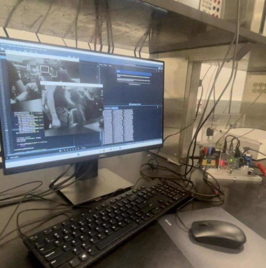
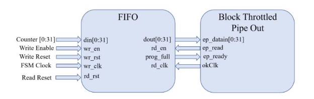
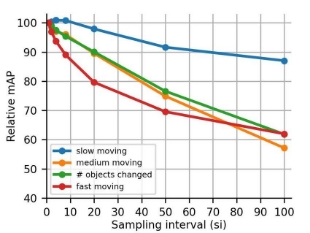
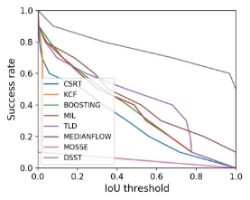
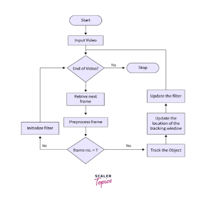
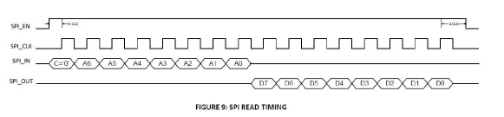
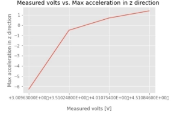

**ECE 437 Final Report**

**Realtime Object Tracking on an XEM7310 FPGA**

Arnav Sheth

**Introduction**

This is an implementation for a real-time tracking of an object with the Opal Kelly’s XEM7310 FPGA and ECE 437 sensor board. Opal Kelly’s data transfer modules allow for the transfer of data between the FPGA and a PC running a Python kernel to interface with the FPGA.

Communication protocols were implemented as **verilog state machines** and Python functions were used to collect and display the data. Additionally, **PyVISA** was used to communicate with benchtop equipment via the **SCPI command language** for electrical characterization and control of the power supply and motor. The utilized sensors and their associated communication protocol are summarized in the table below.

|**Sensor**|**Communication Protocol**|
| - | - |
|CMV300 Imaging Sensor|SPI|
|LSM303DLHC Magnetometer and Accelerometer|I2C|
|PMOD DHB1|PWM|

Realtime tracking was enabled by the MedianFlow tracker in OpenCV using frames collected by the FPGA from the CMV300 sensor and sent to the PC via the **OkBTPipeOut** module at a maximum rate of 300 MB/s. Various clocks were created within Verilog in order to run the different state machines and ensure seamless synchronization between modules. To address the crossing of clock domains, we incorporated a **FIFO module** into our design.

**Details on implementation**

The below diagram taken from the ECE 437 Canvas page for Lab 9 displays the hardware instantiated in Verilog for the transfer of CMV300 frames to Python.

**Python and OpenCV tracking**

We used Python to primarily control our FPGA. The python sent in values and triggers to the FPGA while the FPGA received the outputs from the sensors and this was overlaid by OpenCV. The values for the frames were received in a numpy array. We did a few bit manipulation and added some granularity and the image was displayed. The Motor was controlled by sending in bursts of pulses for how long the motor should run for. The I2C was initialized to read about 4 values per frame or 100 readings per second.

We used the OpenCV library in python to show and track an object. The tracking implementation we had initially used was CSRT. This tracker is based on Discriminative Correlation Filter with Channel and Spatial Reliability. This tracker was really effective in tracking but was also very resource intensive. We decided to try out the MOSSE tracker and it was really ineffective in tracking objects. It lost the object with a very quick jerk and could not trace it back. The best tracker we found out was the MedianFlow tracker. This tracker was significantly more responsive and accurate compared to MOSSE and was also not really as resource intensive as CSRT. Median Flow suggests taking the median of the vectors. That is, list the movement of the points on the x-axis and take the median. Same for the y-axis. Scale is calculated by considering all pairs of points and measuring the relative change in distance (distNew/distOld). This implementation is much better if there is a bigger contrast ratio/ separation between a background and the foreground. The tracking is also much more improved if the object speed is slower.

The accuracy of mFlow tracker with respect to speed is given below. (Taken from Research Gate)

The graph below shows the different tracking algorithm with its success rate (Taken from Research Gate).

The FlowChart indicates how the trackers work on a high level. (Taken from https://www.scaler.com/topics/object-tracking-algorithms/)

**Verilog**

We joined all our State machines from the I2C lab, motor controller and the SPI lab with the camera. We used a Clock Generator to control all the clocks. The SPI state machine ran at 20Mhz, I2C state machine ran at 400Khz and the Motor controller at 200Hz. The FIFO allowed us to collect all the values from a CMOS sensor and send it through using BTPipeout. We ended up reducing the delay between a request for frame to 0 as we were sending in frame requests every 1/25th of a second.

**Sensors and communication protocols**

Our Verilog state machines for I2C and SPI were based off the following references. I2C:

Reading data

SPI:

The standard deviation of the **acceleration sensor** readings were taken across 3 sets of 100 readings in order to derive the **sensor noise value**. Note that this value would vary across the different sensor boards in the lab and is dependent on temperature and other external factors as per the datasheet.

<table><tr><th colspan="1" rowspan="2" valign="top"><b>Trial</b></th><th colspan="3" valign="top"><b>Standard deviation of acceleration readings</b></th></tr>
<tr><td colspan="1" valign="top"><b>X</b></td><td colspan="1" valign="top"><b>Y</b></td><td colspan="1" valign="top"><b>Z</b></td></tr>
<tr><td colspan="1">1</td><td colspan="1">0\.729040912179069</td><td colspan="1">0\.035812915240561</td><td colspan="1">0\.043452424314214</td></tr>
<tr><td colspan="1" valign="top">2</td><td colspan="1" valign="top">0\.731050932149062</td><td colspan="1" valign="top">0\.034882948283765</td><td colspan="1" valign="top">0\.044421244431241</td></tr>
<tr><td colspan="1">3</td><td colspan="1">0\.710104191217958</td><td colspan="1">0\.031832918585663</td><td colspan="1">0\.055452424312245</td></tr>
<tr><td colspan="1" valign="top">Mean</td><td colspan="1" valign="top">0\.723399</td><td colspan="1" valign="top">0\.034176</td><td colspan="1" valign="top">0\.047775364</td></tr>
</table>

The noise induced was reasonably low and our accelerometer readings were accurate enough for our purposes. Implementing a **moving average filter** in Python would help reduce noise provided the sensor wasn’t faulty enough to create significantly disruptive transient spikes.

For the CMV300 image sensor, we were able to compute temporal and spatial noise across image frames by analyzing our frames through 1D lists of pixels in Python. **Temporal noise** was calculated as the **standard deviation in the intensity of pixel (50,50) across a set of 100 frames. Spatial noise was calculated as the standard deviation in intensity across all 640\*480 pixels while the sensor was blocked from receiving any light.** Hence, temporal noise can be thought of as the variations in frame intensity on a pixel by pixel basis across different ambient conditions while spatial noise consists of the digital values generated by photodiodes in the CMOS sensor when no external photons fall upon them.

|**Temporal noise**|**Spatial noise**|
| - | - |
|0\.49257314506006505|0\.4678490986707166|

Temporal noise can be reduced with longer exposure times, frame stacking (for pixel averaging) and temperature control. Spatial noise is usually a hardware limitation but its impact can be minimized with a higher **signal to noise ratio (SNR)**, which we calculated next. We computed the value as a ratio of the average intensity to the standard deviation. This reading was computed across 100 different frames.

|**Average intensity of pixel (50,50)**|3\.47|
| - | - |
|**Standard deviation across pixels**|0\.49997449174806385|
|**Signal to noise ratio (SNR)**|6\.94|

**Electrical characterization of the swivel motor**

To understand the limitations of our swivel motor and understand the relationship **between motor voltage and linear acceleration of the tracking apparatus**, we used PyVISA to control a power supply and procure a plot for linearly increasing voltage versus the change in acceleration along the z-axis (since this is the plane within which the apparatus swivels. The plots below demonstrate the linear relationship between acceleration and the applied voltage.

**Conclusion**

We were able to implement a Real time tracker on an Opal Kelly FPGA and it was able to display a video over 20 FPS and the motors moved in the direction that the object moved. This was supplemented with a 100 readings per second of accelerometer and magnetometer data.

We enjoyed making a real time tracker and we would like to take this space to thank Professor Viktor Gruev and the TA’s Yifei Jin and Brianna Hajek for the constant support and guiding us to the right methods. This class allowed us to learn more about how people in industry and research create a new firmware/code for any sensors and integrate them together.

Python Code

############################################################################ ##################### FUNCTIONS FOR OUR USE

- Function to swap every 4 bytes in a buffer

def swap(buf):

buf\_rearranged = bytearray(len(buf))

for i in range(0, len(buf), 4):

chunk = buf[i:i + 4] # Extract 4-byte chunk

chunk[:] = chunk[::-1] # Reverse the entire 4-byte chunk

buf\_rearranged[i:i + 4] = chunk # Store the modified chunk in the rearranged array

return buf\_rearranged

- Function to swap upper and lower byte of a 16 bit value passed in def bits(value):
  - Mask to extract upper 8 bits (most significant bits)

upper\_mask = (value & 0xFF00) >> 8

- Mask to extract lower 8 bits (least significant bits)

lower\_mask = (value & 0x00FF) << 8

- Combine the swapped bits

swapped\_value = upper\_mask | lower\_mask

if swapped\_value & 0x8000:

signed\_value = -((swapped\_value ^ 0xFFFF) + 1)

else:

signed\_value = swapped\_value

return signed\_value

- def tracking():
- def i2c\_reading():

############################################################################ ##################### IMPORTS

import threading

import numpy as np

import pyvisa as visa # You should pip install pyvisa and restart the kernel. import numpy as np

import matplotlib as mpl

import matplotlib.pyplot as plt

mpl.style.use('ggplot')

import numpy as np

from PIL import Image import cv2

import time

import threading

- import various libraries necessary to run your Python code

import sys,os # system related library

ok\_sdk\_loc = "C:\\Program Files\\Opal Kelly\\FrontPanelUSB\\API\\Python\\x64" ok\_dll\_loc = "C:\\Program Files\\Opal Kelly\\FrontPanelUSB\\API\\lib\\x64" sys.path.append(ok\_sdk\_loc) # add the path of the OK library os.add\_dll\_directory(ok\_dll\_loc)

import ok # OpalKelly library

- Define FrontPanel device variable, open USB communication and
- load the bit file in the FPGA

dev = ok.okCFrontPanel() # define a device for FrontPanel communication SerialStatus=dev.OpenBySerial("") # open USB communication with the OK board

- We will NOT load the bit file because it will be loaded using JTAG interface from Vivado
- Check if FrontPanel is initialized correctly and if the bit file is loaded.
- Otherwise terminate the program

print("----------------------------------------------------")

############################################################################ ##################### FRONTPANEL INITIALIZATION

if SerialStatus == 0:

print ("FrontPanel host interface was successfully initialized.")

else:

print ("FrontPanel host interface not detected. The error code number is:" + str(int(SerialStatus)))

print("Exiting the program.")

sys.exit ()

############################################################################ ##################### INSTRUMENT INITIALIZATION

device\_manager = visa.ResourceManager()

devices = device\_manager.list\_resources()

number\_of\_device = len(devices)

- device initializations power\_supply\_id = -1 waveform\_generator\_id = -1 digital\_multimeter\_id = -1 oscilloscope\_id = -1
- assumes only the DC power supply is connected for i in range (0, number\_of\_device):
- check that it is actually the power supply

try:

device\_temp = device\_manager.open\_resource(devices[i])

print("Instrument connect on USB port number [" + str(i) + "] is " + device\_temp.query("\*IDN?"))

if (device\_temp.query("\*IDN?") == 'HEWLETT-PACKARD,E3631A,0,3.2-6.0-2.0\r\n'):

power\_supply\_id = i

if (device\_temp.query("\*IDN?") == 'HEWLETT-PACKARD,E3631A,0,3.0-6.0-2.0\r\n'):

power\_supply\_id = i

if (device\_temp.query("\*IDN?") == 'Agilent Technologies,33511B,MY52301259,3.03-1.19-2.00-52-00\n'):

waveform\_generator\_id = i

if (device\_temp.query("\*IDN?") == 'Agilent Technologies,34461A,MY53207926,A.01.10-02.25-01.10-00.35-01-01\n'):

digital\_multimeter\_id = i

if (device\_temp.query("\*IDN?") == 'Keysight Technologies,34461A,MY53213280,A.02.08-02.37-02.08-00.49-01-01\n'):

digital\_multimeter\_id = i

if (device\_temp.query("\*IDN?") == 'KEYSIGHT TECHNOLOGIES,MSO-X 3024T,MY54440323,07.50.2021102830\n'):

oscilloscope\_id = i

device\_temp.close()

except:

print("Instrument on USB port number [" + str(i) + "] cannot be connected. The instrument might be powered of or you are trying to connect to a mouse or keyboard.\n")

- sit here if power supply wasn't initialized correctly while (power\_supply\_id == -1):

print("Something is wrong!")

############################################################################ ########### POWER SUPPLY READY FOR SUPPLYING PMOD

print("Power supply is connected to the PC.")

power\_supply = device\_manager.open\_resource(devices[power\_supply\_id]) print(power\_supply.write("OUTPUT ON")) # power supply output is turned on power\_supply.write("APPLy P6V, %0.2f, 1" % 4) # DO NOT FORGET TO CLOSE THIS LATER

- pause 50ms to let things settle time.sleep(0.5)

  measured\_voltage = power\_supply.query("MEASure:VOLTage:DC? P6V") # confirm voltage value via SCPI ############################################################################ ########### SPI INITIALIZATION AND CONFIRMATION FOR CAMERA SENSOR

- dictionary for spi values and addresses

dic ={1:232,2:1,42:232,43:5,55:1,57:3, 58:44,59:240,60:10,68:1,69:9,80:2,83:187,97:240,98:10,100:112,101:98,102:34,103:64,106:94, 107:110,108:91,109:82,110:80,117:91}

- initializing spi registers

for i in dic:

dev.SetWireInValue(0x01,dic[i]) dev.UpdateWireIns() dev.SetWireInValue(0x02,i) dev.UpdateWireIns()

SPI\_Control = 3 # send a "go" signal to the SPI FSM dev.SetWireInValue(0x00, SPI\_Control) dev.UpdateWireIns() # Update the WireIns

- time.sleep(0.01)

SPI\_Control = 0 # send a "stop" signal to the FSM dev.SetWireInValue(0x00, SPI\_Control) dev.UpdateWireIns() # Update the WireIns

- print ("writing value into reg:",i,"is",dic[i])
- reading spi registers to confirm values

for i in range (128):

dev.SetWireInValue(0x02,i) dev.UpdateWireIns()

SPI\_Control = 1 # send a "go" signal to the FSM dev.SetWireInValue(0x00, SPI\_Control) dev.UpdateWireIns() # Update the WireIns

- time.sleep(0.01)

SPI\_Control = 0 # send a "stop" signal to the FSM dev.SetWireInValue(0x00, SPI\_Control) dev.UpdateWireOuts()

z = dev.GetWireOutValue(0x20)

print ("the value from reg:",i,"is",z)

############################################################################ ########### I2C/MOTOR PREPARATION SECTION

motor\_pulses = 800 # 10

motor\_control = 0 # 9

i2c\_control = 0 # 4

i2c\_acc\_slave\_address = 0x32 # 5 i2c\_acc\_ctrl\_address = 0b00100000 # 6 i2c\_acc\_ctrl\_data = 0b01010111 # 7 i2c\_acc\_some\_value = 0b10101000 # 8

i2c\_mag\_slave\_address = 0x3C # 5 i2c\_mag\_ctrl\_address = 0x02 # 6 i2c\_mag\_ctrl\_data = 0x00 # 7 i2c\_mag\_some\_value = 0b10000011 # 8

xyz\_acc = [] xyz\_mag = []

width, height = 648, 484

buf = bytearray(width\* height); buf\_rearranged = bytearray(len(buf));

dev.ActivateTriggerIn(0x40, 0); #Reset FIFOs and counter dev.ReadFromBlockPipeOut(0xa0, 32, buf); # Read data from BT PipeOut

for i in range(0, len(buf), 4):

chunk = buf[i:i + 4] # Extract 4-byte chunk

chunk[:] = chunk[::-1] # Reverse the entire 4-byte chunk

buf\_rearranged[i:i + 4] = chunk # Store the modified chunk in the rearranged array

- Creating the image from the byte array (directly with PIL library, no need for making a 2D array)

  img = Image.frombytes('L', (width, height), bytes(buf\_rearranged))

  img.show() # Display the image

  frame = np.reshape(buf\_rearranged,(height,width))

- for i in frame:

print(np.std(buf))

- parameters\_shitomasi = dict(maxCorners=100, qualityLevel=0.3, minDistance=7)
- edges = cv2.goodFeaturesToTrack(prev\_frame, mask = None, \*\*parameters\_shitomasi)
- canvas = np.zeros\_like(buf\_rearranged)
- create random colours for visualization for all 100 max corners for RGB channels
- colours = np.random.randint(0, 255, (100, 3))
- parameter\_lucas\_kanade = dict(winSize=(15, 15), maxLevel=2, criteria=(cv2.TERM\_CRITERIA\_EPS | cv2.TERM\_CRITERIA\_COUNT, 10, 0.03))

tracker = cv2.legacy.TrackerMedianFlow\_create()

bbox = (287, 23, 86, 320)

- Uncomment the line below to select a different bounding box

bbox = cv2.selectROI(frame, False)

- Initialize tracker with first frame and bounding box

ok = tracker.init(frame, bbox)

start\_time = time.time()

frame\_count = 0

prev\_p1=(0,0)

arr=[]

- cv2.namedWindow('Video', cv2.WINDOW\_NORMAL)

while True:

dev.ActivateTriggerIn(0x40, 0); #Reset FIFOs and counter dev.ReadFromBlockPipeOut(0xa0, 32, buf); # Read data from BT PipeOut dev.SetWireInValue(0x09, 0) # reset motor pulse counter dev.UpdateWireIns()

image = np.frombuffer(buf,dtype=np.uint8)

reshaped\_array = image.reshape(int(len(buf)/4), 4)

reversed\_array = np.flip(reshaped\_array, axis=1)

result\_array = reversed\_array.flatten()

frame=np.reshape(result\_array, (height,width))

frame\_count += 1

elapsed\_time = time.time() - start\_time+0.01

fps = frame\_count / elapsed\_time

ok, bbox = tracker.update(frame)

if ok:

- Tracking success

p1 = (int(bbox[0]), int(bbox[1]))

p2 = (int(bbox[0] + bbox[2]), int(bbox[1] + bbox[3]))

cv2.rectangle(frame, p1, p2, (255,0,0), 2, 1)

else :

- Tracking failure

cv2.putText(frame, "Tracking failure detected", (20,80), cv2.FONT\_HERSHEY\_SIMPLEX, 0.5,(0,0,255),1)

- Display tracker type on frame
  - cv2.putText(frame, 'CSRT Tracker', (10,20), cv2.FONT\_HERSHEY\_SIMPLEX, 0.3,

(50,170,50),1);

- Display FPS on frame

cv2.putText(frame, "FPS : " + str(fps), (10,50), cv2.FONT\_HERSHEY\_SIMPLEX, 0.3, (50,170,50), 1);

- cv2.putText(frame, "X : " + str(int(240-p1[1])), (10,70), cv2.FONT\_HERSHEY\_SIMPLEX,

0\.3, (50,170,50), 1);

- cv2.putText(frame, "Y : " + str(int(320-p1[0])), (10,90), cv2.FONT\_HERSHEY\_SIMPLEX,

0\.3, (50,170,50), 1);

if (int(320-p1[0])>20):

dev.SetWireInValue(0x10, int(10)) # set 10 pulses for this voltage dev.SetWireInValue(0x09, 3) # start motor controller

- print("left")

dev.UpdateWireIns()

elif (int(p1[0]-320)>20):

dev.SetWireInValue(0x10, int(10)) # set 10 pulses for this voltage dev.SetWireInValue(0x09, 1) # start motor controller

- print("right")

dev.UpdateWireIns()

dev.UpdateWireIns()

dev.SetWireInValue(0x05,i2c\_acc\_slave\_address) # slave address

dev.UpdateWireIns()

dev.SetWireInValue(0x06,i2c\_acc\_ctrl\_address) # control register address dev.UpdateWireIns()

dev.SetWireInValue(0x07,i2c\_acc\_ctrl\_data) # control register data

dev.UpdateWireIns()

dev.SetWireInValue(0x08,i2c\_acc\_some\_value) # x data with top bit set as 1 for auto increment

i2c\_control = 1 # send a "go" signal to the FSM

dev.SetWireInValue(0x04, i2c\_control)

dev.UpdateWireIns() # Update the WireIn

i2c\_control = 0 # send a "stop" signal to the FSM

dev.SetWireInValue(0x04, i2c\_control)

dev.UpdateWireIns() # Update the WireIns

dev.UpdateWireOuts()

x = dev.GetWireOutValue(0x21)

dev.UpdateWireOuts()

y = dev.GetWireOutValue(0x22)

dev.UpdateWireOuts()

z = dev.GetWireOutValue(0x23)

- arr.append((bits(z)/16200.5333333\*9.8))

print("accelerometer: ",end="")

print([bits(x)/16200.5333333\*9.8, bits(y)/16142.93333333\*9.8, bits(z)/16200.5333333\*9.8])

- print('\n')
- Display result cv2.imshow("Tracking", frame) prev\_p1=p1

if cv2.waitKey(1) & 0xFF == ord('q'):

break

cv2.destroyAllWindows()

print(np.std(arr)) print(power\_supply.write("OUTPUT OFF")) power\_supply.close()

print("closed")

dev.Close

System Verilog Top Level `timescale 1ns / 1ps

module finaltoplevel(

output CVM300\_CLK\_IN, input CVM300\_CLK\_OUT, output CVM300\_SYS\_RES\_N,

output CVM300\_FRAME\_REQ, input CVM300\_Enable\_LVDS, input CVM300\_Line\_valid, input CVM300\_Data\_valid, input [9:0] CVM300\_D,

output CVM300\_SPI\_EN, input CVM300\_SPI\_OUT, output CVM300\_SPI\_CLK, output CVM300\_SPI\_IN,

output [7:0] led, input sys\_clkn, input sys\_clkp,

output LSM303\_INT1, output LSM303\_INT2, output I2C\_SCL\_1, inout I2C\_SDA\_1,

output PMOD\_A1, output PMOD\_A2,

inout PMOD\_A3, inout PMOD\_A4, inout PMOD\_A7, inout PMOD\_A8, inout PMOD\_A9, inout PMOD\_A10,

input [4:0] okUH, output [2:0] okHU, inout [31:0] okUHU, inout okAA

);

///////////////////////////////////////////////////////////// GLOBAL CONTROL VARIABLES wire [31:0] SPI\_control, I2C\_control, motor\_control;

wire TrigerEvent;

// MAIN: WRITTEN TO BY CLOCK GENERATOR wire ILA\_Clk, ACK\_bit, FSM\_Clk; /////////////////////////////////////////////////////////////////// I2C STUFF // monitoring signal from module

wire SCL, SDA;

// monitoring signal from module wire [8:0] I2C\_State;

// coming in from okwirein wire [31:0] tempregadd;

wire [31:0] regadd;

wire [31:0] regval;

wire [31:0] i2c\_slave\_address;

// going out through okwireout

wire [31:0] tempval, tempval2, tempval3;

I2C\_Transmit I2C\_Test1 (

.led(),

.FSM\_Clk(clk),

// .ILA\_Clk(ILA\_Clk),

// .ADT7420\_A0(LSM303\_INT1), // .ADT7420\_A1(LSM303\_INT2),

// directly updates pins with internal happenings .I2C\_SCL\_1(I2C\_SCL\_1), .I2C\_SDA\_1(I2C\_SDA\_1),

.ACK\_bit(ACK\_bit),

// for our own signal monitoring .SCL(),

.SDA(),

.PC\_control(I2C\_control),

// input wires .i2c\_slave\_address(i2c\_slave\_address), .tempregadd(tempregadd), .regadd(regadd),

.regval(regval),

// output regs

.tempval(tempval), .tempval2(tempval2), .tempval3(tempval3)

);

///////////////////////////////////////////////////////////////////////////// VALUES FOR FIFO STUFF TO WORK

localparam STATE\_INIT = 8'd0; localparam STATE\_RESET = 8'd1; localparam STATE\_DELAY = 8'd2; localparam STATE\_RESET\_FINISHED = 8'd3; localparam STATE\_FRAME\_REQ = 8'd4; localparam STATE\_FINISH = 8'd5;

reg [31:0] counter = 8'd0;

reg [15:0] counter\_delay = 16'd0;

reg [7:0] State = STATE\_INIT;

reg [7:0] led\_register = 0;

reg [3:0] button\_reg, write\_enable\_counter;

reg write\_reset, read\_reset, write\_enable = 0; // initialize without initial block??

wire [31:0] Reset\_Counter;

wire [31:0] DATA\_Counter;

wire FIFO\_read\_enable, FIFO\_BT\_BlockSize\_Full, FIFO\_full, FIFO\_empty, BT\_Strobe; wire [31:0] FIFO\_data\_out;

wire clkout;

assign clkout = CVM300\_CLK\_OUT;

reg frame\_req = 0;

wire [7:0] dat;

assign dat = CVM300\_D[9:2];

assign CVM300\_FRAME\_REQ = frame\_req;

//////////////////////////////////////////////////////////////////////////// SPI STUFF wire miso;

wire mosi;

wire en;

wire sclk;

wire [31:0] val;

wire [31:0] add;

wire [31:0] data;

spi\_toplevel spi( .led(), .FSM\_Clk(FSM\_Clk), .ILA\_Clk(ILA\_Clk), .sys\_clkn(sys\_clkn),

.sys\_clkp(sys\_clkp),

.State(SPI\_STATE), .PC\_control(SPI\_control), .CVM300\_SPI\_EN(CVM300\_SPI\_EN), .CVM300\_SPI\_OUT(CVM300\_SPI\_OUT), .CVM300\_SPI\_CLK(CVM300\_SPI\_CLK), .CVM300\_SPI\_IN(CVM300\_SPI\_IN), .miso(miso),

.mosi(mosi),

.sclk(sclk),

.en(en),

.data(data[7:0]),

.val(val),

.add(add[7:0])

);

///////////////////////////////////////////////////////////// MOTOR CONTROLLER

wire [31:0] cycle\_count; // could be made a reg before passing to module?

motor\_controller motor ( .FSM\_Clk(FSM\_Clk),

.led(led),

.PMOD\_A1(PMOD\_A1),

.PMOD\_A2(PMOD\_A2), .PMOD\_A3(PMOD\_A3), .PMOD\_A4(PMOD\_A4), .PMOD\_A7(PMOD\_A7), .PMOD\_A8(PMOD\_A8), .PMOD\_A9(PMOD\_A9),

.PMOD\_A10(PMOD\_A10), .button(motor\_control[3:0]), .cycle\_count(cycle\_count)

);

//////////////////////////////////////////////////////////////////////////////////////// OKHOST STUFF

wire okClk; //These are FrontPanel wires needed to IO communication wire [112:0] okHE; //These are FrontPanel wires needed to IO communication wire [64:0] okEH; //These are FrontPanel wires needed to IO communication

//This is the OK host that allows data to be sent or recived okHost hostIF (

.okUH(okUH),

.okHU(okHU),

.okUHU(okUHU),

.okClk(okClk),

.okAA(okAA),

.okHE(okHE),

.okEH(okEH)

);

////////////////////////////////////////////////////////////////////////////////////////////// FIFO MODULE

fifo\_generator\_0 FIFO\_for\_Counter\_BTPipe\_Interface (

.wr\_clk(CVM300\_CLK\_OUT),

.wr\_rst(write\_reset),

.rd\_clk(okClk),

.rd\_rst(read\_reset),

.din(CVM300\_D[9:2]),

.wr\_en(CVM300\_Data\_valid && CVM300\_Line\_valid), // write to FIFO when line valid signal goes high... what about data valid?

.rd\_en(FIFO\_read\_enable),

.dout(FIFO\_data\_out),

.full(FIFO\_full),

.empty(FIFO\_empty),

.prog\_full(FIFO\_BT\_BlockSize\_Full)

);

/////////////////////////////////////////////////////////// OK WIRE INS FOR CONTROLLING SPI AND CAMERA

okWireIn wire0 ( .okHE(okHE),

.ep\_addr(8'h00), .ep\_dataout(SPI\_control));

okWireIn wire1 ( .okHE(okHE),

.ep\_addr(8'h01), .ep\_dataout(data));

okWireIn wire2 ( .okHE(okHE),

.ep\_addr(8'h02), .ep\_dataout(add));

// okWireIn wire3 ( .okHE(okHE),

// .ep\_addr(8'h03),

// .ep\_dataout(Reset\_Counter));

// I2C wireins

okWireIn wire4 ( .okHE(okHE),

.ep\_addr(8'h04),

.ep\_dataout(I2C\_control)); okWireIn wire5 ( .okHE(okHE),

.ep\_addr(8'h05),

.ep\_dataout(i2c\_slave\_address)); okWireIn wire6 ( .okHE(okHE),

.ep\_addr(8'h06),

.ep\_dataout(tempregadd)); okWireIn wire7 ( .okHE(okHE),

.ep\_addr(8'h07),

.ep\_dataout(regval));

okWireIn wire8 ( .okHE(okHE),

.ep\_addr(8'h08), .ep\_dataout(regadd));

// motor wireins

okWireIn wire9 ( .okHE(okHE),

.ep\_addr(8'h09), .ep\_dataout(motor\_control));

okWireIn wire10 ( .okHE(okHE),

.ep\_addr(8'h10),

.ep\_dataout(cycle\_count));

reg [8:0]cnt;

reg clk;

always @(posedge FSM\_Clk) begin

if (cnt >= 10) begin

cnt <= 0;

clk <= ~clk; // Toggle the output clock

end else begin

cnt <= cnt + 1;

end

end

okTriggerIn trigIn53 (.okHE(okHE),.ep\_addr(8'h40), .ep\_clk(FSM\_Clk), .ep\_trigger(Reset\_Counter));

// okTriggerIn trigIn44 (.okHE(okHE),.ep\_addr(8'h44), .ep\_clk(clk), .ep\_trigger(I2C\_control));

//////////////////////////////////////////////////////////// OK WIRE OUTS FOR SPI CONFIRMATION

localparam endPt\_count = 2 + 3;

wire [endPt\_count\*65-1:0] okEHx;

okWireOR # (.N(endPt\_count)) wireOR (okEH, okEHx);

okWireOut wire20 ( .okHE(okHE), .okEH(okEHx[ 0\*65 +: 65 ]), .ep\_addr(8'h20),

.ep\_datain(val));

okBTPipeOut CounterToPC (

.okHE(okHE),

.okEH(okEHx[ 1\*65 +: 65 ]), .ep\_addr(8'hA0), .ep\_datain(FIFO\_data\_out), .ep\_read(FIFO\_read\_enable), .ep\_blockstrobe(BT\_Strobe), .ep\_ready(FIFO\_BT\_BlockSize\_Full)

);

okWireOut wire21 ( .okHE(okHE), .okEH(okEHx[ 2\*65 +: 65 ]), .ep\_addr(8'h21), .ep\_datain(tempval[15:0]));

okWireOut wire22 ( .okHE(okHE), .okEH(okEHx[ 3\*65 +: 65 ]), .ep\_addr(8'h22), .ep\_datain(tempval2[15:0]));

okWireOut wire23 ( .okHE(okHE), .okEH(okEHx[ 4\*65 +: 65 ]), .ep\_addr(8'h23), .ep\_datain(tempval3[15:0]));

////////////////////////////////////////////////////////// CAMERA READING CODE -> CLOCKS CONTROLLED INSIDE SPI MODULE

// reg [8:0]cnt=0;

// reg clk;

assign CVM300\_CLK\_IN = FSM\_Clk;

// always @(posedge FSM) begin

// if (cnt >= 40) begin

// cnt <= 0;

// clk <= ~clk; // Toggle the output clock

// end

// else begin

// cnt <= cnt + 1;

// end

// end

always @(posedge FSM\_Clk) begin

if (Reset\_Counter[0] == 1'b1) State <= STATE\_RESET;

case (State)

STATE\_INIT: begin

if (Reset\_Counter[0] == 1'b1) State <= STATE\_RESET;

end

STATE\_RESET: begin

counter <= 0;

counter\_delay <= 0;

write\_reset <= 1'b1;

read\_reset <= 1'b1;

if (Reset\_Counter[0] == 1'b0) State <= STATE\_RESET\_FINISHED;

end

STATE\_RESET\_FINISHED: begin

write\_reset <= 1'b0;

read\_reset <= 1'b0;

State <= STATE\_DELAY;

end

STATE\_DELAY: begin // does this state also give us the necessary wait time of 1 us?

if (counter\_delay == 16'b0000\_0000\_0000\_0000) State <= STATE\_FRAME\_REQ; else counter\_delay <= counter\_delay + 1;

end

STATE\_FRAME\_REQ: begin

frame\_req <= 1;

State <= STATE\_FINISH; end

STATE\_FINISH: begin

frame\_req <= 0;

State <= STATE\_INIT; // you just sit here, the DVAL will handle the write enable as pixels get written

end

endcase

end

////////////////////////////////////////////////////////////////////////////// ILA MODULE ila\_0 ila\_sample12 (

.clk(ILA\_Clk),

.probe0(dat[7:0]),//8

.probe1(frame\_req), //1 .probe2({Reset\_Counter[0],FSM\_Clk}), //1

.probe3(clkout) //1

// .probe4(CVM300\_CLK\_IN) //1

// .probe5(Reset\_Counter[0]), // .probe6(State)

); endmodule

I2C Module `timescale 1ns / 1ps

module I2C\_Transmit(

output [7:0] led,

input FSM\_Clk,

// input ILA\_Clk,

// output ADT7420\_A0,

// output ADT7420\_A1,

output I2C\_SCL\_1,

inout I2C\_SDA\_1,

output reg ACK\_bit,

output reg SCL,

output reg SDA,

output reg [8:0] I2C\_State,

input wire [31:0] PC\_control,

input wire [31:0] i2c\_slave\_address,

input wire [31:0] tempregadd,

input wire [31:0] regadd,

input wire [31:0] regval,

output reg [31:0] tempval, tempval2, tempval3 );

localparam STATE\_INIT = 9'd0; assign led[7] = ACK\_bit;

assign I2C\_SCL\_1 = SCL; assign I2C\_SDA\_1 = SDA;

initial begin

SCL = 1'b1;

SDA = 1'b1; ACK\_bit = 1'b1; I2C\_State = 9'd0;

tempval = 0;

tempval2 = 0;

tempval3 = 0;

end // these are all module parameter registers sent out for monitoring and recording

/\* always @(\*) begin FSM\_Clk\_reg = FSM\_Clk;

ILA\_Clk\_reg = ILA\_Clk; end \*/

always @(posedge FSM\_Clk) begin

case (I2C\_State)

STATE\_INIT : begin

if (PC\_control[0] == 1'b1) I2C\_State <= 9'd1; else begin

SCL <= 1'b1;

SDA <= 1'b1;

I2C\_State <= 9'd0;

end

end

// This is the Start sequence

9'd1 : begin

SCL <= 1'b1;

SDA <= 1'b0;

I2C\_State <= I2C\_State + 1'b1; end

// SCL low

9'd2 : begin

SCL <= 1'b0;

SDA <= 1'b0;

I2C\_State <= I2C\_State + 1'b1;

end

// transmit bit 7 start device address transmission 9'd3 : begin

SCL <= 1'b0;

SDA <= i2c\_slave\_address[7];

I2C\_State <= I2C\_State + 1'b1;

end

9'd4 : begin

SCL <= 1'b1;

I2C\_State <= I2C\_State + 1'b1;

end

9'd5 : begin

SCL <= 1'b1;

I2C\_State <= I2C\_State + 1'b1;

end

9'd6 : begin

SCL <= 1'b0;

I2C\_State <= I2C\_State + 1'b1;

end

// transmit bit 6

9'd7 : begin

SCL <= 1'b0;

SDA <= i2c\_slave\_address[6]; I2C\_State <= I2C\_State + 1'b1;

end

9'd8 : begin

SCL <= 1'b1;

I2C\_State <= I2C\_State + 1'b1;

end

9'd9 : begin

SCL <= 1'b1;

I2C\_State <= I2C\_State + 1'b1;

end

9'd10 : begin

SCL <= 1'b0;

I2C\_State <= I2C\_State + 1'b1;

end

// transmit bit 5

9'd11 : begin

SCL <= 1'b0;

SDA <= i2c\_slave\_address[5]; I2C\_State <= I2C\_State + 1'b1;

end

9'd12 : begin

SCL <= 1'b1;

I2C\_State <= I2C\_State + 1'b1;

end

9'd13 : begin

SCL <= 1'b1;

I2C\_State <= I2C\_State + 1'b1;

end

9'd14 : begin

SCL <= 1'b0;

I2C\_State <= I2C\_State + 1'b1;

end

// transmit bit 4

9'd15 : begin

SCL <= 1'b0;

SDA <= i2c\_slave\_address[4]; I2C\_State <= I2C\_State + 1'b1;

end

9'd16 : begin

SCL <= 1'b1;

I2C\_State <= I2C\_State + 1'b1;

end

9'd17 : begin

SCL <= 1'b1;

I2C\_State <= I2C\_State + 1'b1;

end

9'd18 : begin

SCL <= 1'b0;

I2C\_State <= I2C\_State + 1'b1;

end

// transmit bit 3

9'd19 : begin

SCL <= 1'b0;

SDA <= i2c\_slave\_address[3]; I2C\_State <= I2C\_State + 1'b1;

end

9'd20 : begin

SCL <= 1'b1;

I2C\_State <= I2C\_State + 1'b1;

end

9'd21 : begin

SCL <= 1'b1;

I2C\_State <= I2C\_State + 1'b1;

end

9'd22 : begin

SCL <= 1'b0;

I2C\_State <= I2C\_State + 1'b1;

end

// transmit bit 2

9'd23 : begin

SCL <= 1'b0;

SDA <= i2c\_slave\_address[2]; I2C\_State <= I2C\_State + 1'b1;

end

9'd24 : begin

SCL <= 1'b1;

I2C\_State <= I2C\_State + 1'b1;

end

9'd25 : begin

SCL <= 1'b1;

I2C\_State <= I2C\_State + 1'b1;

end

9'd26 : begin

SCL <= 1'b0;

I2C\_State <= I2C\_State + 1'b1;

end

// transmit bit 1

9'd27 : begin

SCL <= 1'b0;

SDA <= i2c\_slave\_address[1]; I2C\_State <= I2C\_State + 1'b1;

end

9'd28 : begin

SCL <= 1'b1;

I2C\_State <= I2C\_State + 1'b1; end

9'd29 : begin

SCL <= 1'b1;

I2C\_State <= I2C\_State + 1'b1;

end

9'd30 : begin

SCL <= 1'b0;

I2C\_State <= I2C\_State + 1'b1;

end

// transmit bit 0

9'd31 : begin

SCL <= 1'b0;

SDA <= i2c\_slave\_address[0]; I2C\_State <= I2C\_State + 1'b1;

end

9'd32 : begin

SCL <= 1'b1;

I2C\_State <= I2C\_State + 1'b1;

end

9'd33 : begin

SCL <= 1'b1;

I2C\_State <= I2C\_State + 1'b1;

end

9'd34 : begin

SCL <= 1'b0;

I2C\_State <= I2C\_State + 1'b1;

end

// read the ACK bit from the sensor and display it on LED[7] 9'd35 : begin

SCL <= 1'b0;

SDA <= 1'bz;

I2C\_State <= I2C\_State + 1'b1;

end

9'd36 : begin

SCL <= 1'b1;

I2C\_State <= I2C\_State + 1'b1; end

9'd37 : begin

SCL <= 1'b1;

ACK\_bit <= SDA;

I2C\_State <= I2C\_State + 1'b1;

end

9'd38 : begin

SCL <= 1'b0;

I2C\_State <= I2C\_State + 1'b1;

end

9'd39 : begin

SCL<= 1'b0;

SDA <= tempregadd[7];

I2C\_State<=I2C\_State+ 1'b1; end

9'd40 : begin

SCL<= 1'b1;

// SDA <= tempregadd[7]; I2C\_State<=I2C\_State+ 1'b1;

end

9'd41 : begin

SCL<= 1'b1;

// SDA <= tempregadd[7]; I2C\_State<=I2C\_State+ 1'b1;

end

9'd42 : begin

SCL<= 1'b0;

// SDA <= tempregadd[7]; I2C\_State<=I2C\_State+ 1'b1;

end

9'd43 : begin

SCL<= 1'b0;

SDA <= tempregadd[6];

I2C\_State<=I2C\_State+ 1'b1; end

9'd44 : begin

SCL<= 1'b1;

// SDA <= tempregadd[6]; I2C\_State<=I2C\_State+ 1'b1;

end

9'd45 : begin

SCL<= 1'b1;

// SDA <= tempregadd[6];

I2C\_State<=I2C\_State+ 1'b1; end

9'd46 : begin

SCL<= 1'b0;

// SDA <= tempregadd[6]; I2C\_State<=I2C\_State+ 1'b1;

end

9'd47 : begin

SCL<= 1'b0;

SDA <= tempregadd[5];

I2C\_State<=I2C\_State+ 1'b1; end

9'd48 : begin

SCL<= 1'b1;

// SDA <= tempregadd[5]; I2C\_State<=I2C\_State+ 1'b1;

end

9'd49 : begin

SCL<= 1'b1;

// SDA <= tempregadd[5]; I2C\_State<=I2C\_State+ 1'b1;

end

9'd50 : begin

SCL<= 1'b0;

// SDA <= tempregadd[5]; I2C\_State<=I2C\_State+ 1'b1;

end

9'd51 : begin

SCL<= 1'b0;

SDA <= tempregadd[4];

I2C\_State<=I2C\_State+ 1'b1; end

9'd52 : begin

SCL<= 1'b1;

// SDA <= tempregadd[4]; I2C\_State<=I2C\_State+ 1'b1;

end

9'd53 : begin

SCL<= 1'b1;

// SDA <= tempregadd[4]; I2C\_State<=I2C\_State+ 1'b1;

end

9'd54 : begin

SCL<= 1'b0;

// SDA <= tempregadd[4];

I2C\_State<=I2C\_State+ 1'b1; end

9'd55 : begin

SCL<= 1'b0;

SDA <= tempregadd[3];

I2C\_State<=I2C\_State+ 1'b1; end

9'd56 : begin

SCL<= 1'b1;

// SDA <= tempregadd[3]; I2C\_State<=I2C\_State+ 1'b1;

end

9'd57 : begin

SCL<= 1'b1;

// SDA <= tempregadd[3]; I2C\_State<=I2C\_State+ 1'b1;

end

9'd58 : begin

SCL<= 1'b0;

// SDA <= tempregadd[3]; I2C\_State<=I2C\_State+ 1'b1;

end

9'd59 : begin

SCL<= 1'b0;

SDA <= tempregadd[2];

I2C\_State<=I2C\_State+ 1'b1; end

9'd60 : begin

SCL<= 1'b1;

// SDA <= tempregadd[2]; I2C\_State<=I2C\_State+ 1'b1;

end

9'd61 : begin

SCL<= 1'b1;

// SDA <= tempregadd[7]; I2C\_State<=I2C\_State+ 1'b1;

end

9'd62 : begin

SCL<= 1'b0;

// SDA <= tempregadd[2]; I2C\_State<=I2C\_State+ 1'b1;

end

9'd63 : begin

SCL<= 1'b0;

SDA <= tempregadd[1];

I2C\_State<=I2C\_State+ 1'b1; end

9'd64 : begin

SCL<= 1'b1;

// SDA <= tempregadd[1]; I2C\_State<=I2C\_State+ 1'b1;

end

9'd65 : begin

SCL<= 1'b1;

// SDA <= tempregadd[1]; I2C\_State<=I2C\_State+ 1'b1;

end

9'd66 : begin

SCL<= 1'b0;

// SDA <= tempregadd[1]; I2C\_State<=I2C\_State+ 1'b1;

end

9'd67 : begin

SCL<= 1'b0;

SDA <= tempregadd[0];

ACK\_bit<=1;

I2C\_State<=I2C\_State+ 1'b1; end

9'd68 : begin

SCL<= 1'b1;

// SDA <= tempregadd[0]; I2C\_State<=I2C\_State+ 1'b1;

end

9'd69 : begin

SCL<= 1'b1;

// SDA <= tempregadd[0]; I2C\_State<=I2C\_State+ 1'b1;

end

9'd70 : begin

SCL<= 1'b0;

// SDA <= tempregadd[0];

I2C\_State<=I2C\_State+ 1'b1;

end

9'd71 : begin

SCL <= 1'b0;

SDA <= 1'bz;

I2C\_State <= I2C\_State + 1'b1; end

9'd72 : begin

SCL <= 1'b1;

I2C\_State <= I2C\_State + 1'b1;

end

9'd73 : begin

SCL <= 1'b1;

ACK\_bit <= SDA;

I2C\_State <= I2C\_State + 1'b1;

end

9'd74 : begin

SCL <= 1'b0; I2C\_State <= 9'd80;

end

9'd80 : begin

SCL <= 1'b0;

SDA <= regval[7];

I2C\_State <= I2C\_State + 1'b1;

end

9'd81 : begin

SCL <= 1'b1;

I2C\_State <= I2C\_State + 1'b1;

end

9'd82 : begin

SCL <= 1'b1;

I2C\_State <= I2C\_State + 1'b1;

end

9'd83 : begin

SCL <= 1'b0;

I2C\_State <= I2C\_State + 1'b1;

end

// transmit bit 6

9'd84 : begin

SCL <= 1'b0;

SDA <= regval[6];

I2C\_State <= I2C\_State + 1'b1;

end

9'd85 : begin

SCL <= 1'b1;

I2C\_State <= I2C\_State + 1'b1;

end

9'd86 : begin

SCL <= 1'b1;

I2C\_State <= I2C\_State + 1'b1;

end

9'd87 : begin

SCL <= 1'b0;

I2C\_State <= I2C\_State + 1'b1;

end

// transmit bit 5

9'd88 : begin

SCL <= 1'b0;

SDA <= regval[5];

I2C\_State <= I2C\_State + 1'b1;

end

9'd89 : begin

SCL <= 1'b1;

I2C\_State <= I2C\_State + 1'b1;

end

9'd90 : begin

SCL <= 1'b1;

I2C\_State <= I2C\_State + 1'b1;

end

9'd91 : begin

SCL <= 1'b0;

I2C\_State <= I2C\_State + 1'b1;

end

// transmit bit 4

9'd92 : begin

SCL <= 1'b0;

SDA <= regval[4];

I2C\_State <= I2C\_State + 1'b1;

end

9'd93 : begin

SCL <= 1'b1;

I2C\_State <= I2C\_State + 1'b1;

end

9'd94 : begin

SCL <= 1'b1;

I2C\_State <= I2C\_State + 1'b1;

end

9'd95 : begin

SCL <= 1'b0;

I2C\_State <= I2C\_State + 1'b1;

end

// transmit bit 3

9'd96 : begin

SCL <= 1'b0;

SDA <= regval[3];

I2C\_State <= I2C\_State + 1'b1;

end

9'd97 : begin

SCL <= 1'b1;

I2C\_State <= I2C\_State + 1'b1;

end

9'd98 : begin

SCL <= 1'b1;

I2C\_State <= I2C\_State + 1'b1;

end

9'd99 : begin

SCL <= 1'b0;

I2C\_State <= I2C\_State + 1'b1;

end

// transmit bit 2

9'd100 : begin

SCL <= 1'b0;

SDA <= regval[2];

I2C\_State <= I2C\_State + 1'b1;

end

9'd101 : begin

SCL <= 1'b1;

I2C\_State <= I2C\_State + 1'b1;

end

9'd102 : begin

SCL <= 1'b1;

I2C\_State <= I2C\_State + 1'b1;

end

9'd103 : begin

SCL <= 1'b0;

I2C\_State <= I2C\_State + 1'b1;

end

// transmit bit 1

9'd104 : begin

SCL <= 1'b0;

SDA <= regval[1];

I2C\_State <= I2C\_State + 1'b1;

end

9'd105 : begin

SCL <= 1'b1;

I2C\_State <= I2C\_State + 1'b1;

end

9'd106 : begin

SCL <= 1'b1;

I2C\_State <= I2C\_State + 1'b1;

end

9'd107 : begin

SCL <= 1'b0;

I2C\_State <= I2C\_State + 1'b1;

end

// transmit bit 0

9'd108 : begin

SCL <= 1'b0;

SDA <=regval[0];

ACK\_bit=1;

I2C\_State <= I2C\_State + 1'b1;

end

9'd109 : begin

SCL <= 1'b1;

I2C\_State <= I2C\_State + 1'b1;

9'd110 : begin

SCL <= 1'b1;

I2C\_State <= I2C\_State + 1'b1;

end

9'd111 : begin

SCL <= 1'b0;

I2C\_State <= I2C\_State + 1'b1;

end

// read the ACK bit from the sensor and display it on LED[7]

9'd112 : begin

SCL <= 1'b0;

SDA <= 1'bz;

I2C\_State <= I2C\_State + 1'b1;

end

9'd113 : begin

SCL <= 1'b1;

I2C\_State <= I2C\_State + 1'b1;

end

9'd114 : begin

SCL <= 1'b1;

ACK\_bit <= SDA;

I2C\_State <= I2C\_State + 1'b1;

end

9'd115 : begin

SCL <= 1'b0;

I2C\_State <= I2C\_State + 1'b1; end

9'd116 : begin

SCL <= 1'b0;

SDA<= 1'b0;

I2C\_State <= I2C\_State + 1'b1; end

9'd117 : begin

SCL <= 1'b0;

SDA<=1'b1;

I2C\_State <= I2C\_State + 1'b1; end

9'd118 : begin

SCL <= 1'b1;

//SDA<= 1'b1;

I2C\_State <= I2C\_State + 1'b1; end

9'd119 : begin

SCL<= 1'b1;

SDA <= 1'b0;

I2C\_State <= I2C\_State + 1'b1; end

9'd120 : begin

SCL <= 1'b0;

SDA <= 1'b0;

I2C\_State <= I2C\_State + 1'b1; end

9'd121 : begin

SCL <= 1'b0;

SDA <= i2c\_slave\_address[7]; I2C\_State <= I2C\_State + 1'b1;

end

9'd122 : begin

SCL <= 1'b1;

I2C\_State <= I2C\_State + 1'b1;

end

9'd123 : begin

SCL <= 1'b1;

I2C\_State <= I2C\_State + 1'b1;

end

9'd124 : begin

SCL <= 1'b0;

I2C\_State <= I2C\_State + 1'b1;

end

// transmit bit 6

9'd125 : begin

SCL <= 1'b0;

SDA <= i2c\_slave\_address[6]; I2C\_State <= I2C\_State + 1'b1;

end

9'd126 : begin

SCL <= 1'b1;

I2C\_State <= I2C\_State + 1'b1;

end

9'd127 : begin

SCL <= 1'b1;

I2C\_State <= I2C\_State + 1'b1;

end

9'd128 : begin

SCL <= 1'b0;

I2C\_State <= I2C\_State + 1'b1;

end

// transmit bit 5

9'd129 : begin

SCL <= 1'b0;

SDA <= i2c\_slave\_address[5]; I2C\_State <= I2C\_State + 1'b1;

end

9'd130: begin

SCL <= 1'b1;

I2C\_State <= I2C\_State + 1'b1;

end

9'd131 : begin

SCL <= 1'b1;

I2C\_State <= I2C\_State + 1'b1;

end

9'd132 : begin

SCL <= 1'b0;

I2C\_State <= I2C\_State + 1'b1;

end

// transmit bit 4

9'd133 : begin

SCL <= 1'b0;

SDA <= i2c\_slave\_address[4]; I2C\_State <= I2C\_State + 1'b1;

end

9'd134 : begin

SCL <= 1'b1;

I2C\_State <= I2C\_State + 1'b1;

end

9'd135 : begin

SCL <= 1'b1;

I2C\_State <= I2C\_State + 1'b1;

end

9'd136 : begin

SCL <= 1'b0;

I2C\_State <= I2C\_State + 1'b1;

end

// transmit bit 3

9'd137 : begin

SCL <= 1'b0;

SDA <= i2c\_slave\_address[3]; I2C\_State <= I2C\_State + 1'b1;

end

9'd138 : begin

SCL <= 1'b1;

I2C\_State <= I2C\_State + 1'b1;

end

9'd139 : begin

SCL <= 1'b1;

I2C\_State <= I2C\_State + 1'b1;

end

9'd140 : begin

SCL <= 1'b0;

I2C\_State <= I2C\_State + 1'b1;

end

// transmit bit 2

9'd141 : begin

SCL <= 1'b0;

SDA <= i2c\_slave\_address[2]; I2C\_State <= I2C\_State + 1'b1;

end

9'd142 : begin

SCL <= 1'b1;

I2C\_State <= I2C\_State + 1'b1; end

9'd143 : begin

SCL <= 1'b1;

I2C\_State <= I2C\_State + 1'b1;

end

9'd144 : begin

SCL <= 1'b0;

I2C\_State <= I2C\_State + 1'b1;

end

// transmit bit 1

9'd145 : begin

SCL <= 1'b0;

SDA <= i2c\_slave\_address[1]; I2C\_State <= I2C\_State + 1'b1;

end

9'd146 : begin

SCL <= 1'b1;

I2C\_State <= I2C\_State + 1'b1;

end

9'd147 : begin

SCL <= 1'b1;

I2C\_State <= I2C\_State + 1'b1;

end

9'd148 : begin

SCL <= 1'b0;

I2C\_State <= I2C\_State + 1'b1;

end

// transmit bit 0

9'd149 : begin

SCL <= 1'b0;

SDA <= i2c\_slave\_address[0]; I2C\_State <= I2C\_State + 1'b1;

end

9'd150 : begin

SCL <= 1'b1;

I2C\_State <= I2C\_State + 1'b1; end

9'd151 : begin

SCL <= 1'b1;

I2C\_State <= I2C\_State + 1'b1;

end

9'd152 : begin

SCL <= 1'b0;

I2C\_State <= I2C\_State + 1'b1;

end

// read the ACK bit from the sensor and display it on LED[7] 9'd153 : begin

SCL <= 1'b0;

SDA <= 1'bz;

I2C\_State <= I2C\_State + 1'b1;

end

9'd154 : begin

SCL <= 1'b1;

I2C\_State <= I2C\_State + 1'b1;

end

9'd155 : begin

SCL <= 1'b1;

ACK\_bit <= SDA;

I2C\_State <= I2C\_State + 1'b1;

end

9'd156 : begin

SCL <= 1'b0;

I2C\_State <= I2C\_State + 1'b1;

end

9'd157 : begin

SCL<= 1'b0;

SDA <= regadd[7];

I2C\_State<=I2C\_State+ 1'b1; end

9'd158 : begin

SCL<= 1'b1;

// SDA <= tempregadd[7]; I2C\_State<=I2C\_State+ 1'b1;

end

9'd159 : begin

SCL<= 1'b1;

// SDA <= tempregadd[7]; I2C\_State<=I2C\_State+ 1'b1;

end

9'd160 : begin

SCL<= 1'b0;

// SDA <= tempregadd[7]; I2C\_State<=I2C\_State+ 1'b1;

end

9'd161 : begin

SCL<= 1'b0;

SDA <= regadd[6];

I2C\_State<=I2C\_State+ 1'b1; end

9'd162: begin

SCL<= 1'b1;

// SDA <= tempregadd[6]; I2C\_State<=I2C\_State+ 1'b1;

end

9'd163 : begin

SCL<= 1'b1;

// SDA <= tempregadd[6]; I2C\_State<=I2C\_State+ 1'b1;

end

9'd164 : begin

SCL<= 1'b0;

// SDA <= tempregadd[6]; I2C\_State<=I2C\_State+ 1'b1;

end

9'd165 : begin

SCL<= 1'b0;

SDA <= regadd[5];

I2C\_State<=I2C\_State+ 1'b1; end

9'd166 : begin

SCL<= 1'b1;

// SDA <= tempregadd[5]; I2C\_State<=I2C\_State+ 1'b1;

end

9'd167 : begin

SCL<= 1'b1;

// SDA <= tempregadd[5]; I2C\_State<=I2C\_State+ 1'b1;

end

9'd168 : begin

SCL<= 1'b0;

// SDA <= tempregadd[5]; I2C\_State<=I2C\_State+ 1'b1;

end

9'd169 : begin

SCL<= 1'b0;

SDA <= regadd[4];

I2C\_State<=I2C\_State+ 1'b1; end

9'd170 : begin

SCL<= 1'b1;

// SDA <= tempregadd[4]; I2C\_State<=I2C\_State+ 1'b1;

end

9'd171 : begin

SCL<= 1'b1;

// SDA <= tempregadd[4]; I2C\_State<=I2C\_State+ 1'b1;

end

9'd172 : begin

SCL<= 1'b0;

// SDA <= tempregadd[4]; I2C\_State<=I2C\_State+ 1'b1;

end

9'd173 : begin

SCL<= 1'b0;

SDA <= regadd[3];

I2C\_State<=I2C\_State+ 1'b1; end

9'd174 : begin

SCL<= 1'b1;

// SDA <= tempregadd[3]; I2C\_State<=I2C\_State+ 1'b1;

end

9'd175 : begin

SCL<= 1'b1;

// SDA <= tempregadd[3]; I2C\_State<=I2C\_State+ 1'b1;

end

9'd176 : begin

SCL<= 1'b0;

// SDA <= tempregadd[3]; I2C\_State<=I2C\_State+ 1'b1;

end

9'd177 : begin

SCL<= 1'b0;

SDA <= regadd[2];

I2C\_State<=I2C\_State+ 1'b1; end

9'd178 : begin

SCL<= 1'b1;

// SDA <= tempregadd[2]; I2C\_State<=I2C\_State+ 1'b1;

end

9'd179 : begin

SCL<= 1'b1;

// SDA <= tempregadd[7]; I2C\_State<=I2C\_State+ 1'b1;

end

9'd180 : begin

SCL<= 1'b0;

// SDA <= tempregadd[2]; I2C\_State<=I2C\_State+ 10;

end

9'd190 : begin

SCL<= 1'b0;

SDA <= regadd[1];

I2C\_State<=I2C\_State+ 1'b1; end

9'd191 : begin

SCL<= 1'b1;

// SDA <= tempregadd[1]; I2C\_State<=I2C\_State+ 1'b1;

end

9'd192 : begin

SCL<= 1'b1;

// SDA <= tempregadd[1]; I2C\_State<=I2C\_State+ 1'b1;

end

9'd193 : begin

SCL<= 1'b0;

// SDA <= tempregadd[1]; I2C\_State<=I2C\_State+ 1'b1;

end

9'd194 : begin

SCL<= 1'b0;

SDA <= regadd[0];

ACK\_bit<=1;

I2C\_State<=I2C\_State+ 1'b1; end

9'd195 : begin

SCL<= 1'b1;

// SDA <= tempregadd[0]; I2C\_State<=I2C\_State+ 1'b1;

end

9'd196 : begin

SCL<= 1'b1;

// SDA <= tempregadd[0]; I2C\_State<=I2C\_State+ 1'b1;

end

9'd197 : begin

SCL<= 1'b0;

// SDA <= tempregadd[0];

I2C\_State<=I2C\_State+ 1'b1;

end

9'd198 : begin

SCL <= 1'b0;

SDA <= 1'bz;

I2C\_State <= I2C\_State + 1'b1;

end

9'd199 : begin

SCL <= 1'b1;

I2C\_State <= I2C\_State + 1'b1;

end

9'd200 : begin

SCL <= 1'b1;

ACK\_bit <= SDA;

I2C\_State <= I2C\_State + 1'b1;

end

9'd201 : begin

SCL <= 1'b0;

I2C\_State <= I2C\_State + 1'b1;

end

//Beginning restart///////////////////////////////////////////////////////////////////// 9'd202 : begin

SCL <= 1'b0;

SDA<= 1'b0;

I2C\_State <= I2C\_State + 1'b1;

end

9'd203 : begin

SCL <= 1'b0;

SDA<=1'b1;

I2C\_State <= I2C\_State + 1'b1; end

9'd204 : begin

SCL <= 1'b1;

//SDA<= 1'b1;

I2C\_State <= I2C\_State + 1'b1; end

9'd205 : begin

SCL<= 1'b1;

SDA <= 1'b0;

I2C\_State <= I2C\_State + 1'b1; end

9'd206 : begin

SCL <= 1'b0;

SDA <= 1'b0;

I2C\_State <= I2C\_State + 1'b1; end

9'd207 : begin

SCL <= 1'b0;

SDA <= i2c\_slave\_address[7]; I2C\_State <= I2C\_State + 1'b1;

end

9'd208 : begin

SCL <= 1'b1;

I2C\_State <= I2C\_State + 1'b1;

end

9'd209 : begin

SCL <= 1'b1;

I2C\_State <= I2C\_State + 1'b1;

end

9'd210 : begin

SCL <= 1'b0;

I2C\_State <= I2C\_State + 1'b1;

end

// transmit bit 6

9'd211 : begin

SCL <= 1'b0;

SDA <= i2c\_slave\_address[6];

I2C\_State <= I2C\_State + 1'b1; end

9'd212 : begin

SCL <= 1'b1;

I2C\_State <= I2C\_State + 1'b1;

end

9'd213 : begin

SCL <= 1'b1;

I2C\_State <= I2C\_State + 1'b1;

end

9'd214 : begin

SCL <= 1'b0;

I2C\_State <= I2C\_State + 1'b1;

end

// transmit bit 5

9'd215 : begin

SCL <= 1'b0;

SDA <= i2c\_slave\_address[5]; I2C\_State <= I2C\_State + 1'b1;

end

9'd216 : begin

SCL <= 1'b1;

I2C\_State <= I2C\_State + 1'b1;

end

9'd217: begin

SCL <= 1'b1;

I2C\_State <= I2C\_State + 1'b1;

end

9'd218 : begin

SCL <= 1'b0;

I2C\_State <= I2C\_State + 1'b1;

end

// transmit bit 4

9'd219 : begin

SCL <= 1'b0;

SDA <= i2c\_slave\_address[4];

I2C\_State <= I2C\_State + 1'b1; end

9'd220 : begin

SCL <= 1'b1;

I2C\_State <= I2C\_State + 1'b1;

end

9'd221 : begin

SCL <= 1'b1;

I2C\_State <= I2C\_State + 1'b1;

end

9'd222 : begin

SCL <= 1'b0;

I2C\_State <= I2C\_State + 1'b1;

end

// transmit bit 3

9'd223 : begin

SCL <= 1'b0;

SDA <= i2c\_slave\_address[3]; I2C\_State <= I2C\_State + 1'b1;

end

9'd224 : begin

SCL <= 1'b1;

I2C\_State <= I2C\_State + 1'b1;

end

9'd225 : begin

SCL <= 1'b1;

I2C\_State <= I2C\_State + 1'b1;

end

9'd226 : begin

SCL <= 1'b0;

I2C\_State <= I2C\_State + 1'b1;

end

// transmit bit 2

9'd227 : begin

SCL <= 1'b0;

SDA <= i2c\_slave\_address[2]; I2C\_State <= I2C\_State + 1'b1;

SCL <= 1'b1;

I2C\_State <= I2C\_State + 1'b1;

end

9'd229 : begin

SCL <= 1'b1;

I2C\_State <= I2C\_State + 1'b1;

end

9'd230 : begin

SCL <= 1'b0;

I2C\_State <= I2C\_State + 1'b1;

end

// transmit bit 1

9'd231 : begin

SCL <= 1'b0;

SDA <= i2c\_slave\_address[1]; I2C\_State <= I2C\_State + 1'b1;

end

9'd232 : begin

SCL <= 1'b1;

I2C\_State <= I2C\_State + 1'b1;

end

9'd233 : begin

SCL <= 1'b1;

I2C\_State <= I2C\_State + 1'b1;

end

9'd234 : begin

SCL <= 1'b0;

I2C\_State <= I2C\_State + 1'b1;

end

// transmit bit 0

9'd235 : begin

SCL <= 1'b0;

SDA <=1'b1;

ACK\_bit=1;

I2C\_State <= I2C\_State + 1'b1;

end

9'd236 : begin

SCL <= 1'b1;

I2C\_State <= I2C\_State + 1'b1;

end

9'd237 : begin

SCL <= 1'b1;

I2C\_State <= I2C\_State + 1'b1;

end

9'd238 : begin

SCL <= 1'b0;

I2C\_State <= I2C\_State + 1'b1;

end

// read the ACK bit from the sensor and display it on LED[7]

9'd239 : begin

SCL <= 1'b0;

SDA <= 1'bz;

I2C\_State <= I2C\_State + 1'b1;

end

9'd240 : begin

SCL <= 1'b1;

I2C\_State <= I2C\_State + 1'b1;

end

9'd241 : begin

SCL <= 1'b1;

ACK\_bit <= SDA;

I2C\_State <= I2C\_State + 1'b1;

end

9'd242 : begin

SCL <= 1'b0;

I2C\_State <= I2C\_State + 1'b1;

end

/////// reading temp msb

9'd243 : begin

SCL<= 1'b0;

SDA<=1'bz;

// tempval[15]<=SDA;

I2C\_State<=I2C\_State+ 1'b1;

end

9'd244 : begin

SCL<= 1'b1;

I2C\_State<=I2C\_State+ 1'b1; end

9'd245 : begin

SCL<= 1'b1;

tempval[15]<=SDA;

I2C\_State<=I2C\_State+ 1'b1; end

9'd246 : begin

SCL<= 1'b0;

I2C\_State<=I2C\_State+ 1'b1; end

9'd247 : begin

SCL<= 1'b0;

// tempval[14]<=SDA; I2C\_State<=I2C\_State+ 1'b1;

end

9'd248 : begin

SCL<= 1'b1;

I2C\_State<=I2C\_State+ 1'b1; end

9'd249 : begin

SCL<= 1'b1;

tempval[14]<=SDA;

I2C\_State<=I2C\_State+ 1'b1; end

9'd250 : begin

SCL<= 1'b0;

I2C\_State<=I2C\_State+ 1'b1; end

9'd251 : begin

SCL<= 1'b0;

// tempval[13]<=SDA; I2C\_State<=I2C\_State+ 1'b1;

end

9'd252 : begin

SCL<= 1'b1;

I2C\_State<=I2C\_State+ 1'b1; end

9'd253 : begin

SCL<= 1'b1;

tempval[13]<=SDA;

I2C\_State<=I2C\_State+ 1'b1; end

9'd254 : begin

SCL<= 1'b0;

I2C\_State<=I2C\_State+ 1'b1; end

9'd255 : begin

SCL<= 1'b0;

// tempval[12]<=SDA; I2C\_State<=I2C\_State+ 1'b1;

end

9'd256 : begin

SCL<= 1'b1;

I2C\_State<=I2C\_State+ 1'b1; end

9'd257 : begin

SCL<= 1'b1;

tempval[12]<=SDA;

I2C\_State<=I2C\_State+ 1'b1; end

9'd258 : begin

SCL<= 1'b0;

I2C\_State<=I2C\_State+ 1'b1; end

9'd259 : begin

SCL<= 1'b0;

// tempval[11]<=SDA; I2C\_State<=I2C\_State+ 1'b1;

end

9'd260 : begin

SCL<= 1'b1;

I2C\_State<=I2C\_State+ 1'b1;

end

9'd261 : begin

SCL<= 1'b1;

tempval[11]<=SDA;

I2C\_State<=I2C\_State+ 1'b1; end

9'd262 : begin

SCL<= 1'b0;

I2C\_State<=I2C\_State+ 1'b1; end

9'd263 : begin

SCL<= 1'b0;

// tempval[10]<=SDA; I2C\_State<=I2C\_State+ 1'b1;

end

9'd264 : begin

SCL<= 1'b1;

I2C\_State<=I2C\_State+ 1'b1; end

9'd265 : begin

SCL<= 1'b1;

tempval[10]<=SDA;

I2C\_State<=I2C\_State+ 1'b1; end

9'd266 : begin

SCL<= 1'b0;

I2C\_State<=I2C\_State+ 1'b1; end

9'd267 : begin

SCL<= 1'b0;

// tempval[9]<=SDA; I2C\_State<=I2C\_State+ 1'b1;

end

9'd268 : begin

SCL<= 1'b1;

I2C\_State<=I2C\_State+ 1'b1; end

9'd269 : begin

SCL<= 1'b1;

tempval[9]<=SDA;

I2C\_State<=I2C\_State+ 1'b1; end

9'd270 : begin

SCL<= 1'b0;

I2C\_State<=I2C\_State+ 1'b1; end

9'd271 : begin

SCL<= 1'b0;

// tempval[8]<=SDA; I2C\_State<=I2C\_State+ 1'b1;

end

9'd272 : begin

SCL<= 1'b1;

I2C\_State<=I2C\_State+ 1'b1; end

9'd273 : begin

SCL<= 1'b1;

tempval[8]<=SDA; I2C\_State<=I2C\_State+ 1'b1;

end

9'd274 : begin

SCL<= 1'b0;

I2C\_State<=I2C\_State+ 1'b1;

end

// begin MASTER ACKNOWLEDGEMENT

9'd275 : begin

SCL <= 1'b0;

SDA <= 1'b0; ///SETTING MASTER ACK VALUE TO 0 I2C\_State <= I2C\_State + 1'b1;

end

9'd276 : begin

SCL <= 1'b1;

I2C\_State <= I2C\_State + 1'b1;

end

9'd277 : begin

SCL <= 1'b1;

// ACK\_bit <= SDA;

I2C\_State <= I2C\_State + 1'b1;

end

9'd278 : begin

SCL <= 1'b0;

I2C\_State <= I2C\_State + 1'b1;

//// BEGINNING LSB REG

end

9'd279 : begin

SCL<= 1'b0;

SDA<=1'bz;

I2C\_State<=I2C\_State+ 1'b1; end

9'd280 : begin

SCL<= 1'b1;

I2C\_State<=I2C\_State+ 1'b1; end

9'd281 : begin

SCL<= 1'b1;

tempval[7]<=SDA;

I2C\_State<=I2C\_State+ 1'b1; end

9'd282 : begin

SCL<= 1'b0;

I2C\_State<=I2C\_State+ 1'b1; end

9'd283 : begin

SCL<= 1'b0;

I2C\_State<=I2C\_State+ 1'b1; end

9'd284 : begin

SCL<= 1'b1;

I2C\_State<=I2C\_State+ 1'b1; end

9'd285 : begin

SCL<= 1'b1; tempval[6]<=SDA; I2C\_State<=I2C\_State+ 1'b1;

end

9'd286 : begin

SCL<= 1'b0;

I2C\_State<=I2C\_State+ 1'b1; end

9'd287 : begin

SCL<= 1'b0;

// tempval[5]<=SDA; I2C\_State<=I2C\_State+ 1'b1;

end

9'd288 : begin

SCL<= 1'b1;

I2C\_State<=I2C\_State+ 1'b1; end

9'd289 : begin

SCL<= 1'b1;

tempval[5]<=SDA;

I2C\_State<=I2C\_State+ 1'b1; end

9'd290 : begin

SCL<= 1'b0;

I2C\_State<=I2C\_State+ 1'b1; end

9'd291 : begin

SCL<= 1'b0;

// tempval[4]<=SDA; I2C\_State<=I2C\_State+ 1'b1;

end

9'd292 : begin

SCL<= 1'b1;

I2C\_State<=I2C\_State+ 1'b1; end

9'd293 : begin

SCL<= 1'b1;

tempval[4]<=SDA;

I2C\_State<=I2C\_State+ 1'b1; end

9'd294 : begin

SCL<= 1'b0;

I2C\_State<=I2C\_State+ 1'b1; end

9'd295 : begin

SCL<= 1'b0;

// tempval[3]<=SDA; I2C\_State<=I2C\_State+ 1'b1;

end

9'd296 : begin

SCL<= 1'b1;

I2C\_State<=I2C\_State+ 1'b1; end

9'd297 : begin

SCL<= 1'b1;

tempval[3]<=SDA;

I2C\_State<=I2C\_State+ 1'b1; end

9'd298 : begin

SCL<= 1'b0;

I2C\_State<=I2C\_State+ 1'b1; end

9'd299 : begin

SCL<= 1'b0;

// tempval[2]<=SDA; I2C\_State<=I2C\_State+ 1'b1;

end

9'd300 : begin

SCL<= 1'b1;

I2C\_State<=I2C\_State+ 1'b1; end

9'd301 : begin

SCL<= 1'b1;

tempval[2]<=SDA;

I2C\_State<=I2C\_State+ 1'b1; end

9'd302 : begin

SCL<= 1'b0;

I2C\_State<=I2C\_State+ 1'b1;

end

9'd303 : begin

SCL<= 1'b0;

// tempval[1]<=SDA; I2C\_State<=I2C\_State+ 1'b1;

end

9'd304 : begin

SCL<= 1'b1;

I2C\_State<=I2C\_State+ 1'b1; end

9'd305 : begin

SCL<= 1'b1;

tempval[1]<=SDA;

I2C\_State<=I2C\_State+ 1'b1; end

9'd306 : begin

SCL<= 1'b0;

I2C\_State<=I2C\_State+ 1'b1; end

9'd307 : begin

SCL<= 1'b0;

// tempval[0]<=SDA; I2C\_State<=I2C\_State+ 1'b1;

end

9'd308 : begin

SCL<= 1'b1;

I2C\_State<=I2C\_State+ 1'b1; end

9'd309 : begin

SCL<= 1'b1;

tempval[0]<=SDA; I2C\_State<=I2C\_State+ 1'b1;

end

9'd310 : begin

SCL<= 1'b0;

I2C\_State<=I2C\_State+ 1'b1;

end

// begin MASTER ACKNOWLEDGEMENT

9'd311 : begin

SCL <= 1'b0;

SDA <= 1'b0; // SETTING MASTER ACK VALUE I2C\_State <= I2C\_State + 1'b1;

end

9'd312 : begin

SCL <= 1'b1;

I2C\_State <= I2C\_State + 1'b1;

end

9'd313 : begin

SCL <= 1'b1;

// ACK\_bit <= SDA;

I2C\_State <= I2C\_State + 1'b1;

end

9'd314 : begin

SCL <= 1'b0;

I2C\_State <= I2C\_State + 1'b1;

end

/////// reading 2nd byte msb ///////////////////////////////////////////////////////////////////////////////////////////////////////////

9'd315 : begin

SCL<= 1'b0;

SDA<=1'bz;

// tempval2[15]<=SDA; I2C\_State<=I2C\_State+ 1'b1;

end

9'd316 : begin

SCL<= 1'b1;

I2C\_State<=I2C\_State+ 1'b1; end

9'd317 : begin

SCL<= 1'b1;

tempval2[15]<=SDA;

I2C\_State<=I2C\_State+ 1'b1; end

9'd318 : begin

SCL<= 1'b0;

I2C\_State<=I2C\_State+ 1'b1; end

9'd319 : begin

SCL<= 1'b0;

// tempval[14]<=SDA; I2C\_State<=I2C\_State+ 1'b1;

end

9'd320 : begin

SCL<= 1'b1;

I2C\_State<=I2C\_State+ 1'b1; end

9'd321 : begin

SCL<= 1'b1;

tempval2[14]<=SDA;

I2C\_State<=I2C\_State+ 1'b1; end

9'd322 : begin

SCL<= 1'b0;

I2C\_State<=I2C\_State+ 1'b1; end

9'd323 : begin

SCL<= 1'b0;

// tempval[13]<=SDA; I2C\_State<=I2C\_State+ 1'b1;

end

9'd324 : begin

SCL<= 1'b1;

I2C\_State<=I2C\_State+ 1'b1; end

9'd325 : begin

SCL<= 1'b1;

tempval2[13]<=SDA;

I2C\_State<=I2C\_State+ 1'b1; end

9'd326 : begin

SCL<= 1'b0;

I2C\_State<=I2C\_State+ 1'b1;

end

9'd327 : begin

SCL<= 1'b0;

// tempval[12]<=SDA; I2C\_State<=I2C\_State+ 1'b1;

end

9'd328 : begin

SCL<= 1'b1;

I2C\_State<=I2C\_State+ 1'b1; end

9'd329 : begin

SCL<= 1'b1;

tempval2[12]<=SDA;

I2C\_State<=I2C\_State+ 1'b1; end

9'd330 : begin

SCL<= 1'b0;

I2C\_State<=I2C\_State+ 1'b1; end

9'd331 : begin

SCL<= 1'b0;

// tempval[11]<=SDA; I2C\_State<=I2C\_State+ 1'b1;

end

9'd332 : begin

SCL<= 1'b1;

I2C\_State<=I2C\_State+ 1'b1; end

9'd333 : begin

SCL<= 1'b1;

tempval2[11]<=SDA;

I2C\_State<=I2C\_State+ 1'b1; end

9'd334 : begin

SCL<= 1'b0;

I2C\_State<=I2C\_State+ 1'b1; end

9'd335 : begin

SCL<= 1'b0;

// tempval[10]<=SDA;

I2C\_State<=I2C\_State+ 1'b1; end

9'd336 : begin

SCL<= 1'b1;

I2C\_State<=I2C\_State+ 1'b1; end

9'd337 : begin

SCL<= 1'b1;

tempval2[10]<=SDA;

I2C\_State<=I2C\_State+ 1'b1; end

9'd338 : begin

SCL<= 1'b0;

I2C\_State<=I2C\_State+ 1'b1; end

9'd339 : begin

SCL<= 1'b0;

// tempval[9]<=SDA; I2C\_State<=I2C\_State+ 1'b1;

end

9'd340 : begin

SCL<= 1'b1;

I2C\_State<=I2C\_State+ 1'b1; end

9'd341 : begin

SCL<= 1'b1;

tempval2[9]<=SDA;

I2C\_State<=I2C\_State+ 1'b1; end

9'd342 : begin

SCL<= 1'b0;

I2C\_State<=I2C\_State+ 1'b1; end

9'd343 : begin

SCL<= 1'b0;

// tempval[8]<=SDA; I2C\_State<=I2C\_State+ 1'b1;

end

9'd344 : begin

SCL<= 1'b1;

I2C\_State<=I2C\_State+ 1'b1; end

9'd345 : begin

SCL<= 1'b1;

tempval2[8]<=SDA; I2C\_State<=I2C\_State+ 1'b1;

end

9'd346 : begin

SCL<= 1'b0;

I2C\_State<=I2C\_State+ 1'b1;

end

// begin MASTER ACKNOWLEDGEMENT

9'd347 : begin

SCL <= 1'b0;

SDA <= 1'b0; ///SETTING MASTER ACK VALUE TO 0 I2C\_State <= I2C\_State + 1'b1;

end

9'd348 : begin

SCL <= 1'b1;

I2C\_State <= I2C\_State + 1'b1;

end

9'd349 : begin

SCL <= 1'b1;

// ACK\_bit <= SDA;

I2C\_State <= I2C\_State + 1'b1;

end

9'd350 : begin

SCL <= 1'b0;

I2C\_State <= I2C\_State + 1'b1;

end

// 2nd byte LSB

9'd351 : begin

SCL<= 1'b0;

SDA<=1'bz;

I2C\_State<=I2C\_State+ 1'b1; end

9'd352 : begin

SCL<= 1'b1;

I2C\_State<=I2C\_State+ 1'b1; end

9'd353 : begin

SCL<= 1'b1;

tempval2[7]<=SDA;

I2C\_State<=I2C\_State+ 1'b1; end

9'd354 : begin

SCL<= 1'b0;

I2C\_State<=I2C\_State+ 1'b1; end

9'd355 : begin

SCL<= 1'b0;

I2C\_State<=I2C\_State+ 1'b1; end

9'd356 : begin

SCL<= 1'b1;

I2C\_State<=I2C\_State+ 1'b1; end

9'd357 : begin

SCL<= 1'b1;

tempval2[6]<=SDA;

I2C\_State<=I2C\_State+ 1'b1; end

9'd358 : begin

SCL<= 1'b0;

I2C\_State<=I2C\_State+ 1'b1; end

9'd359 : begin

SCL<= 1'b0;

// tempval[5]<=SDA; I2C\_State<=I2C\_State+ 1'b1;

end

9'd360 : begin

SCL<= 1'b1;

I2C\_State<=I2C\_State+ 1'b1; end

9'd361 : begin

SCL<= 1'b1;

tempval2[5]<=SDA;

I2C\_State<=I2C\_State+ 1'b1; end

9'd362 : begin

SCL<= 1'b0;

I2C\_State<=I2C\_State+ 1'b1; end

9'd363 : begin

SCL<= 1'b0;

// tempval[4]<=SDA; I2C\_State<=I2C\_State+ 1'b1;

end

9'd364 : begin

SCL<= 1'b1;

I2C\_State<=I2C\_State+ 1'b1; end

9'd365 : begin

SCL<= 1'b1;

tempval2[4]<=SDA;

I2C\_State<=I2C\_State+ 1'b1; end

9'd366 : begin

SCL<= 1'b0;

I2C\_State<=I2C\_State+ 1'b1; end

9'd367 : begin

SCL<= 1'b0;

// tempval[3]<=SDA; I2C\_State<=I2C\_State+ 1'b1;

end

9'd368 : begin

SCL<= 1'b1;

I2C\_State<=I2C\_State+ 1'b1; end

9'd369 : begin

SCL<= 1'b1;

tempval2[3]<=SDA;

I2C\_State<=I2C\_State+ 1'b1; end

9'd370 : begin

SCL<= 1'b0;

I2C\_State<=I2C\_State+ 1'b1; end

9'd371 : begin

SCL<= 1'b0;

// tempval[2]<=SDA; I2C\_State<=I2C\_State+ 1'b1;

end

9'd372 : begin

SCL<= 1'b1;

I2C\_State<=I2C\_State+ 1'b1; end

9'd373 : begin

SCL<= 1'b1;

tempval2[2]<=SDA;

I2C\_State<=I2C\_State+ 1'b1; end

9'd374 : begin

SCL<= 1'b0;

I2C\_State<=I2C\_State+ 1'b1; end

9'd375 : begin

SCL<= 1'b0;

// tempval[1]<=SDA; I2C\_State<=I2C\_State+ 1'b1;

end

9'd376 : begin

SCL<= 1'b1;

I2C\_State<=I2C\_State+ 1'b1; end

9'd377 : begin

SCL<= 1'b1;

tempval2[1]<=SDA;

I2C\_State<=I2C\_State+ 1'b1; end

9'd378 : begin

SCL<= 1'b0;

I2C\_State<=I2C\_State+ 1'b1; end

9'd379 : begin

SCL<= 1'b0;

// tempval[0]<=SDA; I2C\_State<=I2C\_State+ 1'b1;

end

9'd380 : begin

SCL<= 1'b1;

I2C\_State<=I2C\_State+ 1'b1; end

9'd381 : begin

SCL<= 1'b1;

tempval2[0]<=SDA; I2C\_State<=I2C\_State+ 1'b1;

end

9'd382 : begin

SCL<= 1'b0;

I2C\_State<=I2C\_State+ 1'b1;

end

// begin MASTER ACKNOWLEDGEMENT

9'd383 : begin

SCL <= 1'b0;

SDA <= 1'b0; // SETTING MASTER ACK VALUE I2C\_State <= I2C\_State + 1'b1;

end

9'd384 : begin

SCL <= 1'b1;

I2C\_State <= I2C\_State + 1'b1;

end

9'd385 : begin

SCL <= 1'b1;

// ACK\_bit <= SDA;

I2C\_State <= I2C\_State + 1'b1;

end

9'd386 : begin

SCL <= 1'b0;

I2C\_State <= I2C\_State + 1'b1;

end

// 3rd byte MSB

9'd387 : begin

SCL<= 1'b0;

SDA<=1'bz;

// tempval2[15]<=SDA; I2C\_State<=I2C\_State+ 1'b1;

end

9'd388 : begin

SCL<= 1'b1;

I2C\_State<=I2C\_State+ 1'b1; end

9'd389 : begin

SCL<= 1'b1;

tempval3[15]<=SDA;

I2C\_State<=I2C\_State+ 1'b1; end

9'd390 : begin

SCL<= 1'b0;

I2C\_State<=I2C\_State+ 1'b1; end

9'd391 : begin

SCL<= 1'b0;

// tempval[14]<=SDA; I2C\_State<=I2C\_State+ 1'b1;

end

9'd392 : begin

SCL<= 1'b1;

I2C\_State<=I2C\_State+ 1'b1; end

9'd393 : begin

SCL<= 1'b1;

tempval3[14]<=SDA;

I2C\_State<=I2C\_State+ 1'b1; end

9'd394 : begin

SCL<= 1'b0;

I2C\_State<=I2C\_State+ 1'b1; end

9'd395 : begin

SCL<= 1'b0;

// tempval[13]<=SDA; I2C\_State<=I2C\_State+ 1'b1;

end

9'd396 : begin

SCL<= 1'b1;

I2C\_State<=I2C\_State+ 1'b1; end

9'd397 : begin

SCL<= 1'b1;

tempval3[13]<=SDA;

I2C\_State<=I2C\_State+ 1'b1; end

9'd398 : begin

SCL<= 1'b0;

I2C\_State<=I2C\_State+ 1'b1; end

9'd399 : begin

SCL<= 1'b0;

// tempval[12]<=SDA; I2C\_State<=I2C\_State+ 1'b1;

end

9'd400 : begin

SCL<= 1'b1;

I2C\_State<=I2C\_State+ 1'b1; end

9'd401 : begin

SCL<= 1'b1;

tempval3[12]<=SDA; I2C\_State<=I2C\_State+ 1'b1;

end

9'd402 : begin

SCL<= 1'b0;

I2C\_State<=I2C\_State+ 1'b1; end

9'd403 : begin

SCL<= 1'b0;

// tempval[11]<=SDA; I2C\_State<=I2C\_State+ 1'b1;

end

9'd404 : begin

SCL<= 1'b1;

I2C\_State<=I2C\_State+ 1'b1; end

9'd405 : begin

SCL<= 1'b1;

tempval3[11]<=SDA;

I2C\_State<=I2C\_State+ 1'b1; end

9'd406 : begin

SCL<= 1'b0;

I2C\_State<=I2C\_State+ 1'b1; end

9'd407 : begin

SCL<= 1'b0;

// tempval[10]<=SDA; I2C\_State<=I2C\_State+ 1'b1;

end

9'd408 : begin

SCL<= 1'b1;

I2C\_State<=I2C\_State+ 1'b1; end

9'd409 : begin

SCL<= 1'b1;

tempval3[10]<=SDA;

I2C\_State<=I2C\_State+ 1'b1; end

9'd410 : begin

SCL<= 1'b0;

I2C\_State<=I2C\_State+ 1'b1; end

9'd411 : begin

SCL<= 1'b0;

// tempval[9]<=SDA; I2C\_State<=I2C\_State+ 1'b1;

end

9'd412 : begin

SCL<= 1'b1;

I2C\_State<=I2C\_State+ 1'b1; end

9'd413 : begin

SCL<= 1'b1;

tempval3[9]<=SDA;

I2C\_State<=I2C\_State+ 1'b1; end

9'd414 : begin

SCL<= 1'b0;

I2C\_State<=I2C\_State+ 1'b1; end

9'd415 : begin

SCL<= 1'b0;

// tempval[8]<=SDA; I2C\_State<=I2C\_State+ 1'b1;

end

9'd416 : begin

SCL<= 1'b1;

I2C\_State<=I2C\_State+ 1'b1; end

9'd417 : begin

SCL<= 1'b1;

tempval3[8]<=SDA; I2C\_State<=I2C\_State+ 1'b1;

end

9'd418 : begin

SCL<= 1'b0;

end

// begin MASTER ACKNOWLEDGEMENT

9'd419 : begin

SCL <= 1'b0;

SDA <= 1'b0; ///SETTING MASTER ACK VALUE TO 0 I2C\_State <= I2C\_State + 1'b1;

end

9'd420 : begin

SCL <= 1'b1;

I2C\_State <= I2C\_State + 1'b1;

end

9'd421 : begin

SCL <= 1'b1;

// ACK\_bit <= SDA;

I2C\_State <= I2C\_State + 1'b1;

end

9'd422 : begin

SCL <= 1'b0;

I2C\_State <= I2C\_State + 1'b1;

end

// 3rd byte LSB

9'd423 : begin

SCL<= 1'b0;

SDA<=1'bz;

I2C\_State<=I2C\_State+ 1'b1; end

9'd424 : begin

SCL<= 1'b1;

I2C\_State<=I2C\_State+ 1'b1; end

9'd425 : begin

SCL<= 1'b1;

tempval3[7]<=SDA;

I2C\_State<=I2C\_State+ 1'b1; end

9'd426 : begin

SCL<= 1'b0;

I2C\_State<=I2C\_State+ 1'b1; end

9'd427 : begin

SCL<= 1'b0;

I2C\_State<=I2C\_State+ 1'b1; end

9'd428 : begin

SCL<= 1'b1;

I2C\_State<=I2C\_State+ 1'b1; end

9'd429 : begin

SCL<= 1'b1;

tempval3[6]<=SDA;

I2C\_State<=I2C\_State+ 1'b1; end

9'd430 : begin

SCL<= 1'b0;

I2C\_State<=I2C\_State+ 1'b1; end

9'd431 : begin

SCL<= 1'b0;

// tempval[5]<=SDA; I2C\_State<=I2C\_State+ 1'b1;

end

9'd432 : begin

SCL<= 1'b1;

I2C\_State<=I2C\_State+ 1'b1; end

9'd433 : begin

SCL<= 1'b1;

tempval3[5]<=SDA;

I2C\_State<=I2C\_State+ 1'b1; end

9'd434 : begin

SCL<= 1'b0;

I2C\_State<=I2C\_State+ 1'b1; end

9'd435 : begin

SCL<= 1'b0;

// tempval[4]<=SDA; I2C\_State<=I2C\_State+ 1'b1;

end

9'd436 : begin

SCL<= 1'b1;

I2C\_State<=I2C\_State+ 1'b1; end

9'd437 : begin

SCL<= 1'b1;

tempval3[4]<=SDA;

I2C\_State<=I2C\_State+ 1'b1; end

9'd438 : begin

SCL<= 1'b0;

I2C\_State<=I2C\_State+ 1'b1; end

9'd439 : begin

SCL<= 1'b0;

// tempval[3]<=SDA; I2C\_State<=I2C\_State+ 1'b1;

end

9'd440 : begin

SCL<= 1'b1;

I2C\_State<=I2C\_State+ 1'b1; end

9'd441 : begin

SCL<= 1'b1;

tempval3[3]<=SDA;

I2C\_State<=I2C\_State+ 1'b1; end

9'd442 : begin

SCL<= 1'b0;

I2C\_State<=I2C\_State+ 1'b1; end

9'd443 : begin

SCL<= 1'b0;

// tempval[2]<=SDA; I2C\_State<=I2C\_State+ 1'b1;

end

9'd444 : begin

SCL<= 1'b1;

I2C\_State<=I2C\_State+ 1'b1; end

9'd445 : begin

SCL<= 1'b1;

tempval3[2]<=SDA;

I2C\_State<=I2C\_State+ 1'b1; end

9'd446 : begin

SCL<= 1'b0;

I2C\_State<=I2C\_State+ 1'b1; end

9'd447 : begin

SCL<= 1'b0;

// tempval[1]<=SDA; I2C\_State<=I2C\_State+ 1'b1;

end

9'd448 : begin

SCL<= 1'b1;

I2C\_State<=I2C\_State+ 1'b1; end

9'd449 : begin

SCL<= 1'b1;

tempval3[1]<=SDA;

I2C\_State<=I2C\_State+ 1'b1; end

9'd450 : begin

SCL<= 1'b0;

I2C\_State<=I2C\_State+ 1'b1; end

9'd451 : begin

SCL<= 1'b0;

// tempval[0]<=SDA; I2C\_State<=I2C\_State+ 1'b1;

end

9'd452 : begin

SCL<= 1'b1;

I2C\_State<=I2C\_State+ 1'b1; end

9'd453 : begin

SCL<= 1'b1;

tempval3[0]<=SDA; I2C\_State<=I2C\_State+ 1'b1;

end

9'd454 : begin

SCL<= 1'b0;

I2C\_State<=I2C\_State+ 1'b1;

end

// begin MASTER ACKNOWLEDGEMENT

9'd455 : begin

SCL <= 1'b0;

SDA <= 1'b1; // SETTING MASTER NACK VALUE... FINAL I2C\_State <= I2C\_State + 1'b1;

end

9'd456 : begin

SCL <= 1'b1;

I2C\_State <= I2C\_State + 1'b1;

end

9'd457 : begin

SCL <= 1'b1;

// ACK\_bit <= SDA;

I2C\_State <= I2C\_State + 1'b1;

end

9'd458 : begin

SCL <= 1'b0;

I2C\_State <= I2C\_State + 1'b1;

end

//stop bit sequence and go back to STATE\_INIT 9'd459 : begin

SCL <= 1'b0;

SDA <= 1'b0;

I2C\_State <= I2C\_State + 1'b1;

end

9'd460 : begin

SCL <= 1'b1;

SDA <= 1'b0;

I2C\_State <= I2C\_State + 1'b1;

end

9'd461 : begin

SCL <= 1'b1;

SDA <= 1'b1;

I2C\_State <= STATE\_INIT; end

endcase

end

endmodule SPI Module

module spi\_toplevel(

output [7:0] led, output FSM\_Clk, output ILA\_Clk, input sys\_clkn, input sys\_clkp,

output reg [7:0] State,

input wire [31:0] PC\_control, output CVM300\_SPI\_EN, input CVM300\_SPI\_OUT, output CVM300\_SPI\_CLK, output CVM300\_SPI\_IN, output reg miso,

output reg mosi,

output reg sclk,

output reg en,

input [7:0] data, output reg [31:0] val, input [7:0] add

);

wire [23:0] ClkDivThreshold = 5; // to set FSM clk to 40 kHz? ILA clk is 20 MHz // wire FSM\_Clk, ILA\_Clk;

wire [11:0] div;

reg clkdiv;

reg [8:0] count = 0;

assign div = 12'h800;

// wire [8:0] add=8'h83;

initial

begin

clkdiv = 0;

miso = 1'bz; mosi = 1'b0; sclk =1'b0;

// ACK\_bit = 1'b1;

State = 8'd0;

val = 0;

end

localparam STATE\_INIT = 8'd0;

// always @(\*) begin

// FSM\_Clk\_reg = FSM\_Clk;

// ILA\_Clk\_reg = ILA\_Clk;

// end

ClockGenerator ClockGenerator1(.sys\_clkn(sys\_clkn),

.sys\_clkp(sys\_clkp), .ClkDivThreshold(ClkDivThreshold), .FSM\_Clk(FSM\_Clk), .ILA\_Clk(ILA\_Clk));

assign CVM300\_SPI\_IN=mosi;

assign CVM300\_SPI\_OUT=miso;

assign CVM300\_SPI\_EN=en;

assign CVM300\_SPI\_CLK=sclk;

always @(posedge ILA\_Clk) begin

case (State)

// Press Button[3] to start the state machine. Otherwise, stay in the STATE\_INIT state

STATE\_INIT : begin

en<= 1'b0;

sclk<= 1'b0;

if (PC\_control[0] == 1'b1) State <= 8'd1; else begin

State <= 8'd0;

end

end

8'd1 : begin

en<= 1'b0;

sclk<= 1'b0;

if (PC\_control[1]==1'b1)

State<=8'd100;

else

State <= 8'd30;

end

8'd30: begin

en<= 1'b1;

sclk<= 1'b0;

mosi <= 1'b0;

State <= State + 1'b1; end

8'd31: begin

en<= 1'b1;

sclk<= 1'b1;

State <= State + 1'b1; end

8'd32: begin

en<= 1'b1;

sclk<= 1'b0;

mosi <= add[6];

State <= State + 1'b1; end

8'd33: begin

en<= 1'b1;

sclk<= 1'b1;

State <= State + 1'b1; end

8'd34: begin

en<= 1'b1;

sclk<= 1'b0;

mosi <= add[5];

State <= State + 1'b1; end

8'd35: begin

en<= 1'b1;

sclk<= 1'b1;

State <= State + 1'b1; end

8'd36: begin

en<= 1'b1;

sclk<= 1'b0;

mosi <= add[4];

State <= State + 1'b1; end

8'd37: begin

en<= 1'b1;

sclk<= 1'b1;

State <= State + 1'b1; end

8'd38: begin

en<= 1'b1;

sclk<= 1'b0;

mosi <= add[3];

State <= State + 1'b1; end

8'd39: begin

en<= 1'b1;

sclk<= 1'b1;

State <= State + 1'b1; end

8'd40: begin

en<= 1'b1;

sclk<= 1'b0;

mosi <= add[2];

State <= State + 1'b1; end

8'd41: begin

en<= 1'b1;

sclk<= 1'b1;

State <= State + 1'b1; end

8'd42: begin

en<= 1'b1;

sclk<= 1'b0;

mosi <= add[1];

State <= State + 1'b1;

end

8'd43: begin

en<= 1'b1;

sclk<= 1'b1;

State <= State + 1'b1;

end

8'd44: begin

en<= 1'b1;

sclk<= 1'b0;

mosi <= add[0];

State <= State + 1'b1;

end

8'd45: begin

en<= 1'b1;

sclk<= 1'b1;

State <= State + 1'b1;

end ///////////////////////////////////////////////////////////// 8'd46: begin

en<= 1'b1;

sclk<= 1'b0;

mosi <= 1'b0; val[7]<=CVM300\_SPI\_OUT;

State <= State + 1'b1;

end

8'd47: begin

en<= 1'b1;

sclk<= 1'b1; val[7]<=CVM300\_SPI\_OUT;

State <= State + 1'b1;

end

8'd48: begin

en<= 1'b1;

sclk<= 1'b0;

// mosi <= add[6];

val[6]<=CVM300\_SPI\_OUT;

State <= State + 1'b1;

end

8'd49: begin

en<= 1'b1;

sclk<= 1'b1; val[6]<=CVM300\_SPI\_OUT;

State <= State + 1'b1;

end

8'd50: begin

en<= 1'b1;

sclk<= 1'b0;

// mosi <= add[5];

val[5]<=CVM300\_SPI\_OUT; State <= State + 1'b1;

end

8'd51: begin

en<= 1'b1;

sclk<= 1'b1; val[5]<=CVM300\_SPI\_OUT; State <= State + 1'b1;

end

8'd52: begin

en<= 1'b1;

sclk<= 1'b0;

// mosi <= add[4];

val[4]<=CVM300\_SPI\_OUT; State <= State + 1'b1;

end

8'd53: begin

en<= 1'b1;

sclk<= 1'b1; val[4]<=CVM300\_SPI\_OUT; State <= State + 1'b1;

end

8'd54: begin

en<= 1'b1;

sclk<= 1'b0;

// mosi <= add[3];

val[3]<=CVM300\_SPI\_OUT; State <= State + 1'b1;

end

8'd55: begin

en<= 1'b1;

sclk<= 1'b1; val[3]<=CVM300\_SPI\_OUT; State <= State + 1'b1;

end

8'd56: begin

en<= 1'b1;

sclk<= 1'b0;

// mosi <= add[2];

val[2]<=CVM300\_SPI\_OUT; State <= State + 1'b1;

end

8'd57: begin

en<= 1'b1;

sclk<= 1'b1; val[2]<=CVM300\_SPI\_OUT;

State <= State + 1'b1;

end

8'd58: begin

en<= 1'b1;

sclk<= 1'b0;

// mosi <= add[1];

val[1]<=CVM300\_SPI\_OUT;

State <= State + 1'b1;

end

8'd59: begin

en<= 1'b1;

sclk<= 1'b1; val[1]<=CVM300\_SPI\_OUT;

State <= State + 1'b1;

end

8'd60: begin

en<= 1'b1;

sclk<= 1'b0;

// mosi <= add[0];

val[0]<=CVM300\_SPI\_OUT;

State <= State + 1'b1;

end

8'd61: begin

en<= 1'b1;

sclk<= 1'b1; val[0]<=CVM300\_SPI\_OUT;

State <= State + 1'b1;

end

8'd62: begin

en<= 1'b1;

sclk<= 1'b0;

State <= State + 1'b1;

end

8'd63: begin

en<= 1'b0;

sclk<= 1'b0;

if (PC\_control[0] == 1'b0) State <= 8'd0; else begin

State <= State;

end

end

8'd100: begin

en<= 1'b1;

sclk<= 1'b0;

mosi <= 1'b1;

State <= State + 1'b1; end

8'd101: begin

en<= 1'b1;

sclk<= 1'b1;

State <= State + 1'b1; end

8'd102: begin

en<= 1'b1;

sclk<= 1'b0;

mosi <= add[6];

State <= State + 1'b1; end

8'd103: begin

en<= 1'b1;

sclk<= 1'b1;

State <= State + 1'b1; end

8'd104: begin

en<= 1'b1;

sclk<= 1'b0;

mosi <= add[5];

State <= State + 1'b1; end

8'd105: begin

en<= 1'b1;

sclk<= 1'b1;

State <= State + 1'b1; end

8'd106: begin

en<= 1'b1;

sclk<= 1'b0;

mosi <= add[4];

State <= State + 1'b1; end

8'd107: begin

en<= 1'b1;

sclk<= 1'b1;

State <= State + 1'b1; end

8'd108: begin

en<= 1'b1;

sclk<= 1'b0;

mosi <= add[3];

State <= State + 1'b1; end

8'd109: begin

en<= 1'b1;

sclk<= 1'b1;

State <= State + 1'b1; end

8'd110: begin

en<= 1'b1;

sclk<= 1'b0;

mosi <= add[2];

State <= State + 1'b1; end

8'd111: begin

en<= 1'b1;

sclk<= 1'b1;

State <= State + 1'b1; end

8'd112: begin

en<= 1'b1;

sclk<= 1'b0;

mosi <= add[1];

State <= State + 1'b1; end

8'd113: begin

en<= 1'b1;

sclk<= 1'b1;

State <= State + 1'b1; end

8'd114: begin

en<= 1'b1;

sclk<= 1'b0;

mosi <= add[0];

State <= State + 1'b1; end

8'd115: begin

en<= 1'b1;

sclk<= 1'b1;

State <= State + 1'b1; end

8'd116: begin

en<= 1'b1;

sclk<= 1'b0;

mosi <= data[7]; State <= State + 1'b1; end

8'd117: begin

en<= 1'b1;

sclk<= 1'b1;

State <= State + 1'b1; end

8'd118: begin

en<= 1'b1;

sclk<= 1'b0;

mosi <= data[6]; State <= State + 1'b1; end

8'd119: begin

en<= 1'b1;

sclk<= 1'b1;

State <= State + 1'b1; end

8'd120: begin

en<= 1'b1;

sclk<= 1'b0;

mosi <= data[5]; State <= State + 1'b1; end

8'd121: begin

en<= 1'b1;

sclk<= 1'b1;

State <= State + 1'b1; end

8'd122: begin

en<= 1'b1;

sclk<= 1'b0;

mosi <= data[4];

State <= State + 1'b1; end

8'd123: begin

en<= 1'b1;

sclk<= 1'b1;

State <= State + 1'b1; end

8'd124: begin

en<= 1'b1;

sclk<= 1'b0;

mosi <= data[3]; State <= State + 1'b1; end

8'd125: begin

en<= 1'b1;

sclk<= 1'b1;

State <= State + 1'b1; end

8'd126: begin

en<= 1'b1;

sclk<= 1'b0;

mosi <= data[2]; State <= State + 1'b1; end

8'd127: begin

en<= 1'b1;

sclk<= 1'b1;

State <= State + 1'b1; end

8'd128: begin

en<= 1'b1;

sclk<= 1'b0;

mosi <= data[1]; State <= State + 1'b1; end

8'd129: begin

en<= 1'b1;

sclk<= 1'b1;

State <= State + 1'b1; end

8'd130: begin

en<= 1'b1;

sclk<= 1'b0;

mosi <= data[0]; State <= State + 1'b1;

end

8'd131: begin

en<= 1'b1;

sclk<= 1'b1;

State <= State + 1'b1;

end

8'd132: begin

en<= 1'b1;

mosi <= 1'b0;

sclk<= 1'b0;

State <= State + 1'b1;

end

8'd133: begin

en<= 1'b0;

sclk<= 1'b0;

if (PC\_control[0] == 1'b0) State <= 8'd0; else begin

State <= State;

end

end

default : begin // error\_bit <= 0;

end

endcase

end

endmodule

Motor Controller

module motor\_controller(

output [7:0] led,

input reg FSM\_Clk, // curious how this works with a wire input from top level output reg PMOD\_A1,

output reg PMOD\_A2,

inout PMOD\_A3,

inout PMOD\_A4,

inout PMOD\_A7,

inout PMOD\_A8,

inout PMOD\_A9,

inout PMOD\_A10,

input [3:0] button,

input [31:0] cycle\_count

);

end

wire [3:0] hard\_code;

assign hard\_code = 4'b0010;

reg [31:0] counter = 0; reg [31:0] cyc = 0;

reg CLK\_200Hz;

// initial begin // cyc = 0; // end

// directly initialized cyc to 0

always @(posedge FSM\_Clk) begin

if (counter >= 200) begin

counter <= 0;

CLK\_200Hz <= ~CLK\_200Hz; // Toggle the output clock end else begin

counter <= counter + 1;

end

end

// The above creates a new clock to run your motor assign led[7:0] = cyc; // for debugging

always @(posedge CLK\_200Hz) begin

if ((button[0] == 1) && (cyc <= cycle\_count )) begin

PMOD\_A1 <= 1'b1;

cyc <= cyc+1;

end

else begin

PMOD\_A1 <= 1'b0; end

if (button[1] == 1) begin

PMOD\_A2 <= 1;

// counter++;

end

else begin

PMOD\_A2 <= 0;

if (button[0] == 0) cyc <= 0; // reset cyc when the enable signal goes back down to 0 end

endmodule
