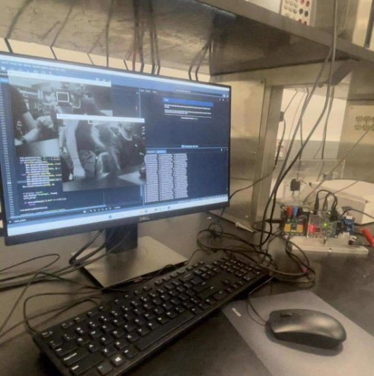
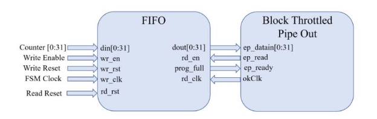
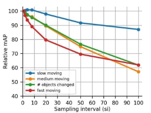
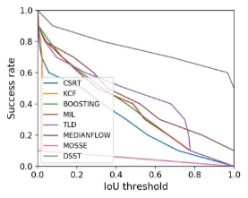
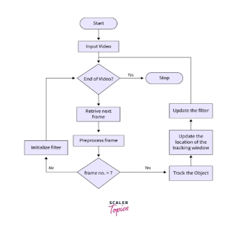
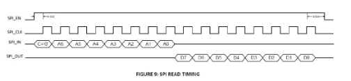
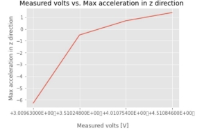

**Project Report**

**Realtime Object Tracking on an XEM7310 FPGA**

Arnav Sheth

**Introduction**

This is an implementation for a real-time tracking of an object with the Opal Kelly’s XEM7310 FPGA and ECE 437 sensor board. Opal Kelly’s data transfer modules allow for the transfer of data between the FPGA and a PC running a Python kernel to interface with the FPGA.

Communication protocols were implemented as **verilog state machines** and Python functions were used to collect and display the data. Additionally, **PyVISA** was used to communicate with benchtop equipment via the **SCPI command language** for electrical characterization and control of the power supply and motor. The utilized sensors and their associated communication protocol are summarized in the table below.

|**Sensor**|**Communication Protocol**|
| - | - |
|CMV300 Imaging Sensor|SPI|
|LSM303DLHC Magnetometer and Accelerometer|I2C|
|PMOD DHB1|PWM|

Realtime tracking was enabled by the MedianFlow tracker in OpenCV using frames collected by the FPGA from the CMV300 sensor and sent to the PC via the **OkBTPipeOut** module at a maximum rate of 300 MB/s. Various clocks were created within Verilog in order to run the different state machines and ensure seamless synchronization between modules. To address the crossing of clock domains, we incorporated a **FIFO module** into our design.

**Details on implementation**

The below diagram taken from the ECE 437 Canvas page for Lab 9 displays the hardware instantiated in Verilog for the transfer of CMV300 frames to Python.

**Python and OpenCV tracking**

We used Python to primarily control our FPGA. The python sent in values and triggers to the FPGA while the FPGA received the outputs from the sensors and this was overlaid by OpenCV. The values for the frames were received in a numpy array. We did a few bit manipulation and added some granularity and the image was displayed. The Motor was controlled by sending in bursts of pulses for how long the motor should run for. The I2C was initialized to read about 4 values per frame or 100 readings per second.

We used the OpenCV library in python to show and track an object. The tracking implementation we had initially used was CSRT. This tracker is based on Discriminative Correlation Filter with Channel and Spatial Reliability. This tracker was really effective in tracking but was also very resource intensive. We decided to try out the MOSSE tracker and it was really ineffective in tracking objects. It lost the object with a very quick jerk and could not trace it back. The best tracker we found out was the MedianFlow tracker. This tracker was significantly more responsive and accurate compared to MOSSE and was also not really as resource intensive as CSRT. Median Flow suggests taking the median of the vectors. That is, list the movement of the points on the x-axis and take the median. Same for the y-axis. Scale is calculated by considering all pairs of points and measuring the relative change in distance (distNew/distOld). This implementation is much better if there is a bigger contrast ratio/ separation between a background and the foreground. The tracking is also much more improved if the object speed is slower.

The accuracy of mFlow tracker with respect to speed is given below. (Taken from Research Gate)

The graph below shows the different tracking algorithm with its success rate (Taken from Research Gate).

The FlowChart indicates how the trackers work on a high level. (Taken from https://www.scaler.com/topics/object-tracking-algorithms/)

**Verilog**

We joined all our State machines from the I2C lab, motor controller and the SPI lab with the camera. We used a Clock Generator to control all the clocks. The SPI state machine ran at 20Mhz, I2C state machine ran at 400Khz and the Motor controller at 200Hz. The FIFO allowed us to collect all the values from a CMOS sensor and send it through using BTPipeout. We ended up reducing the delay between a request for frame to 0 as we were sending in frame requests every 1/25th of a second.

**Sensors and communication protocols**

Our Verilog state machines for I2C and SPI were based off the following references. I2C:

Reading data

SPI:

The standard deviation of the **acceleration sensor** readings were taken across 3 sets of 100 readings in order to derive the **sensor noise value**. Note that this value would vary across the different sensor boards in the lab and is dependent on temperature and other external factors as per the datasheet.

<table><tr><th colspan="1" rowspan="2" valign="top"><b>Trial</b></th><th colspan="3" valign="top"><b>Standard deviation of acceleration readings</b></th></tr>
<tr><td colspan="1" valign="top"><b>X</b></td><td colspan="1" valign="top"><b>Y</b></td><td colspan="1" valign="top"><b>Z</b></td></tr>
<tr><td colspan="1">1</td><td colspan="1">0\.729040912179069</td><td colspan="1">0\.035812915240561</td><td colspan="1">0\.043452424314214</td></tr>
<tr><td colspan="1" valign="top">2</td><td colspan="1" valign="top">0\.731050932149062</td><td colspan="1" valign="top">0\.034882948283765</td><td colspan="1" valign="top">0\.044421244431241</td></tr>
<tr><td colspan="1">3</td><td colspan="1">0\.710104191217958</td><td colspan="1">0\.031832918585663</td><td colspan="1">0\.055452424312245</td></tr>
<tr><td colspan="1" valign="top">Mean</td><td colspan="1" valign="top">0\.723399</td><td colspan="1" valign="top">0\.034176</td><td colspan="1" valign="top">0\.047775364</td></tr>
</table>

The noise induced was reasonably low and our accelerometer readings were accurate enough for our purposes. Implementing a **moving average filter** in Python would help reduce noise provided the sensor wasn’t faulty enough to create significantly disruptive transient spikes.

For the CMV300 image sensor, we were able to compute temporal and spatial noise across image frames by analyzing our frames through 1D lists of pixels in Python. **Temporal noise** was calculated as the **standard deviation in the intensity of pixel (50,50) across a set of 100 frames. Spatial noise was calculated as the standard deviation in intensity across all 640\*480 pixels while the sensor was blocked from receiving any light.** Hence, temporal noise can be thought of as the variations in frame intensity on a pixel by pixel basis across different ambient conditions while spatial noise consists of the digital values generated by photodiodes in the CMOS sensor when no external photons fall upon them.

|**Temporal noise**|**Spatial noise**|
| - | - |
|0\.49257314506006505|0\.4678490986707166|

Temporal noise can be reduced with longer exposure times, frame stacking (for pixel averaging) and temperature control. Spatial noise is usually a hardware limitation but its impact can be minimized with a higher **signal to noise ratio (SNR)**, which we calculated next. We computed the value as a ratio of the average intensity to the standard deviation. This reading was computed across 100 different frames.

|**Average intensity of pixel (50,50)**|3\.47|
| - | - |
|**Standard deviation across pixels**|0\.49997449174806385|
|**Signal to noise ratio (SNR)**|6\.94|

**Electrical characterization of the swivel motor**

To understand the limitations of our swivel motor and understand the relationship **between motor voltage and linear acceleration of the tracking apparatus**, we used PyVISA to control a power supply and procure a plot for linearly increasing voltage versus the change in acceleration along the z-axis (since this is the plane within which the apparatus swivels. The plots below demonstrate the linear relationship between acceleration and the applied voltage.

**Conclusion**

We were able to implement a Real time tracker on an Opal Kelly FPGA and it was able to display a video over 20 FPS and the motors moved in the direction that the object moved. This was supplemented with a 100 readings per second of accelerometer and magnetometer data.

We enjoyed making a real time tracker and we would like to take this space to thank Professor Viktor Gruev and the TA’s Yifei Jin and Brianna Hajek for the constant support and guiding us to the right methods. This class allowed us to learn more about how people in industry and research create a new firmware/code for any sensors and integrate them together.
